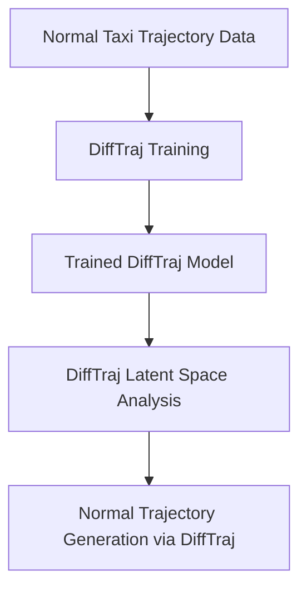

# **Feasible General Flexibility Approach: Synthetic Anomalous Taxi Trajectory Generation with Plug-in Detection**

## **A Practical Implementation Strategy for Master's Thesis Research**

*Presented to: Thesis Coordination Committee*  
*Date: [Current Date]*  
*Research Focus: Diffusion Model-Based Synthetic Data Generation with Established Anomaly Detection*

---

## **🎯 Executive Summary**

This **Feasible General Flexibility Approach** strategically balances research novelty with practical constraints by focusing the innovation on **synthetic anomalous trajectory generation** while leveraging proven, easily-implementable anomaly detection methods. This approach recognizes that [anomalies, by their very definition, are rare and unpredictable events](Anomalous_Taxi_Trajectory_Generation_.md#addressing-data-scarcity-and-imbalance), making the generation of diverse synthetic anomalies the critical research contribution.

### **Key Strategic Decisions**
- **Primary Innovation**: **DiffTraj-based** anomalous trajectory generation with rule-based anomaly injection
- **Secondary Component**: Established, plug-in anomaly detection methods (Autoencoders, Isolation Forest, One-Class SVM)
- **Timeline**: Realistic 8-10 month completion within resource constraints
- **Computational Requirements**: Moderate (8-16 GB GPU, reduced complexity)

---

## **📚 Theoretical Foundation & Simplified Architecture**

### **Core Philosophy: "Generate Complex with DiffTraj, Detect Simple"**

This approach leverages **DiffTraj as the foundational generative model** combined with the insight that [the strategic importance of synthetic data lies in its ability to overcome real-world data limitations by providing scalable, diverse, and privacy-preserving alternatives](Anomalous_Taxi_Trajectory_Generation_.md#executive-summary). The research novelty focuses on **DiffTraj-based anomaly generation** while using well-established detection methods that have proven effectiveness.

### **Component Selection Rationale**

| **Component** | **Selection** | **Feasibility Justification** | **Research Impact** |
|---------------|---------------|-------------------------------|-------------------|
| **Base Model** | **DiffTraj** | • Well-documented implementation¹ • General spatial-temporal modeling • [Inherent privacy-preserving properties](Anomalous_Taxi_Trajectory_Generation_.md#privacy-preserving-synthetic-data-generation) | **High** - Novel anomaly generation |
| **Anomaly Generation** | **Rule-Based + Latent Manipulation** | • [Rule-based methods offer full control and consistency](Anomalous_Taxi_Trajectory_Generation_.md#rule-based-perturbation-methods) • Simpler than adversarial approaches • Faster development and debugging | **High** - Controlled anomaly diversity |
| **Anomaly Detection** | **Autoencoder + Isolation Forest** | • [Autoencoders are well-established for reconstruction-based detection](Anomalous_Taxi_Trajectory_Generation_.md#generative-models-for-synthetic-trajectory-generation) • Isolation Forest handles high-dimensional data well • Both have sklearn implementations | **Medium** - Proven effectiveness |
| **Evaluation** | **Standard Metrics + Domain-Specific** | • [Standard metrics include Precision, Recall, F1-score, AUC](Anomalous_Taxi_Trajectory_Generation_.md#performance-metrics-for-anomaly-detection) • Established benchmarking protocols • Clear success criteria | **Medium** - Comprehensive assessment |

---

## **🔧 Simplified Technical Architecture**

### **Phase 1: Data Generation (Months 1-4) - PRIMARY RESEARCH CONTRIBUTION**

#### **1.1 DiffTraj Foundation Model Training**

**DiffTraj Implementation Details**:
- **Base Architecture**: DiffTraj spatial-temporal diffusion probabilistic model
- **Training Data**: Established [taxi trajectory datasets](Anomalous_Taxi_Trajectory_Generation_.md#key-datasets-and-their-characteristics) (T-Drive, Porto Taxi, NYC Taxi)
- **Implementation Strategy**: Leverage existing DiffTraj codebase with modifications for anomaly injection
- **Focus**: Stable DiffTraj training rather than architectural innovation

#### **1.2 Anomaly Injection Framework**
Based on the [comprehensive anomaly taxonomy](Anomalous_Taxi_Trajectory_Generation_.md#defining-anomalies-in-taxi-trajectories-characteristics-and-types), implement:

**Rule-Based Anomaly Categories**:

| **Anomaly Type** | **Implementation Method** | **Parameters** |
|------------------|---------------------------|----------------|
| **Route Deviations** | Path manipulation algorithms | Deviation distance, frequency |
| **Speed Anomalies** | Velocity profile modification | Speed multipliers, duration |
| **Stop Anomalies** | Unexpected pause injection | Stop duration, location type |
| **Temporal Anomalies** | Trip duration manipulation | Time extension factors |

**Advantages of Rule-Based Approach**:
- [Full control over generated data, ensuring consistency](Anomalous_Taxi_Trajectory_Generation_.md#rule-based-perturbation-methods)
- Facilitates compliance with specific requirements
- Ideal for generating specific edge cases where anomalies are well-understood
- Significantly faster development than learning-based methods

### **Phase 2: Detection Implementation (Months 5-6) - PLUG-IN COMPONENTS**

#### **2.1 Multi-Method Detection Framework**

**Primary Detector: Autoencoder-Based**
- **Rationale**: [Autoencoders learn to compress and reconstruct normal data, producing high reconstruction errors for anomalies](Anomalous_Taxi_Trajectory_Generation_.md#generative-models-for-synthetic-trajectory-generation)
- **Implementation**: Simple LSTM-based autoencoder (proven architecture)
- **Advantage**: Well-established, interpretable results

**Secondary Detector: Isolation Forest**
- **Rationale**: Excellent for high-dimensional trajectory data
- **Implementation**: Sklearn's IsolationForest with trajectory feature engineering
- **Advantage**: No training on normal data required, handles outliers naturally

**Tertiary Detector: One-Class SVM**
- **Rationale**: Defines boundary for normal behavior
- **Implementation**: Sklearn's OneClassSVM with RBF kernel
- **Advantage**: Mathematical foundation, good interpretability

#### **2.2 Feature Engineering for Detection**

Extract standard trajectory features:
- **Spatial**: Distance from shortest path, route complexity
- **Temporal**: Trip duration ratios, speed profiles  
- **Kinematic**: Acceleration patterns, turning angles
- **Statistical**: Mean, variance, percentiles of movement features

---

## **📊 Evaluation Strategy - Comprehensive but Practical**

### **Synthetic Data Quality Assessment**

**Quantitative Metrics** (using established libraries):
- **[Spatial-Temporal Distribution Metrics](Anomalous_Taxi_Trajectory_Generation_.md#realism-and-diversity-metrics-for-synthetic-trajectories)**: 
  - Density error, Trip error, Length error
  - Hausdorff Distance, Sliced Wasserstein Distance
- **Statistical Similarity**: Jensen-Shannon Divergence
- **Diversity Measures**: Distinct n-grams, N-gram Entropy

### **Anomaly Detection Performance**

**Standard Classification Metrics**:
- [Precision, Recall, F1-score](Anomalous_Taxi_Trajectory_Generation_.md#performance-metrics-for-anomaly-detection)
- [ROC-AUC and PR-AUC](Anomalous_Taxi_Trajectory_Generation_.md#performance-metrics-for-anomaly-detection) (particularly important for imbalanced data)
- [Matthews Correlation Coefficient](Anomalous_Taxi_Trajectory_Generation_.md#performance-metrics-for-anomaly-detection)

**Comparative Baselines**:
- Traditional distance-based methods
- Statistical outlier detection
- Random baseline for sanity checking

---

## **🎯 Targeted Anomaly Generation Capabilities**

### **Focus on Well-Defined Anomaly Types**

Based on [the four distinct anomaly behavior patterns](Anomalous_Taxi_Trajectory_Generation_.md#defining-anomalies-in-taxi-trajectories-characteristics-and-types):

| **Pattern** | **Description** | **Generation Method** | **Detection Feasibility** |
|-------------|-----------------|----------------------|---------------------------|
| **Abp1** | Efficient routes (shorter time/distance) | Path optimization algorithms | ✅ **High** |
| **Abp2** | Normal distance, extended time | Traffic simulation, speed reduction | ✅ **High** |
| **Abp3** | Longer distance, normal time | Detour injection with speed compensation | ✅ **Medium-High** |
| **Abp4** | Extended distance and time | [Fraudulent driving simulation](Anomalous_Taxi_Trajectory_Generation_.md#defining-anomalies-in-taxi-trajectories-characteristics-and-types) | ✅ **High** |

### **Practical Anomaly Scenarios**

**Implementable within thesis timeline**:
- ✅ **Route deviations**: [Taking unnecessary detours to overcharge passengers](Anomalous_Taxi_Trajectory_Generation_.md#defining-anomalies-in-taxi-trajectories-characteristics-and-types)
- ✅ **Unusual stops**: Extended stops in non-designated areas
- ✅ **Speed violations**: Excessive speeding or unusually slow driving
- ✅ **Circuitous routes**: [Significantly longer paths for given origin-destination pairs](Anomalous_Taxi_Trajectory_Generation_.md#defining-anomalies-in-taxi-trajectories-characteristics-and-types)

---

## **⏰ Realistic Implementation Timeline**

### **Phase 1: Foundation & Data Generation (Months 1-4)**
- **Month 1**: Literature review completion, dataset acquisition
- **Month 2**: DiffTraj implementation and normal trajectory training
- **Month 3**: Rule-based anomaly injection framework development
- **Month 4**: Synthetic anomaly generation and quality assessment

**Deliverable**: Working synthetic anomaly generation system

### **Phase 2: Detection Implementation (Months 5-6)**
- **Month 5**: Autoencoder and Isolation Forest implementation
- **Month 6**: Feature engineering and multi-method integration

**Deliverable**: Complete detection pipeline

### **Phase 3: Evaluation & Optimization (Months 7-8)**
- **Month 7**: Comprehensive evaluation and baseline comparison
- **Month 8**: System optimization and performance tuning

**Deliverable**: Full evaluation results and performance analysis

### **Phase 4: Documentation & Submission (Months 9-10)**
- **Month 9**: Thesis writing and documentation
- **Month 10**: Final revisions and paper preparation

**Deliverable**: Completed thesis and conference paper submission

---

## **💡 Research Contributions & Impact**

### **Primary Contributions**

1. **Novel DiffTraj-Based Anomaly Generation Framework**: Systematic approach to generating diverse taxi trajectory anomalies using DiffTraj diffusion model with rule-based injection
2. **Comprehensive Anomaly Taxonomy**: [Structured classification of taxi trajectory anomalies](Anomalous_Taxi_Trajectory_Generation_.md#defining-anomalies-in-taxi-trajectories-characteristics-and-types) with DiffTraj-compatible generation methods
3. **Benchmarking Framework**: Standardized evaluation for DiffTraj-generated synthetic anomaly detection
4. **Privacy-Preserving Solution**: [DiffTraj synthetic data that mimics statistical properties without disclosing individual data](Anomalous_Taxi_Trajectory_Generation_.md#addressing-data-scarcity-and-imbalance)

### **Practical Impact**

- **Fleet Management**: Tools for training anomaly detection without sensitive real data
- **Urban Planning**: [Insights into driver and passenger behaviors for traffic management](Anomalous_Taxi_Trajectory_Generation_.md#facilitating-urban-planning-and-traffic-management)
- **Fraud Detection**: Comprehensive training data for detecting taxi fraud patterns

### **Academic Impact**

| **Venue Type** | **Suitability** | **Key Selling Points** |
|---------------|----------------|------------------------|
| **Transportation Conferences** | ✅ **High** | Direct application to taxi fleet management |
| **Data Mining Workshops** | ✅ **High** | Novel synthetic data generation approach |
| **Smart Cities Conferences** | ✅ **Medium-High** | Urban mobility and traffic management applications |

---

## **⚠️ Risk Mitigation & Feasibility Assurance**

### **Technical Risk Management**

| **Risk** | **Probability** | **Mitigation Strategy** |
|----------|----------------|------------------------|
| **DiffTraj Implementation Issues** | Medium | Use existing codebase, community support |
| **Dataset Quality Problems** | Low | [Multiple established datasets available](Anomalous_Taxi_Trajectory_Generation_.md#key-datasets-and-their-characteristics) |
| **Detection Method Performance** | Low | Multiple proven methods, fallback options |
| **Computational Resource Constraints** | Low | Reduced complexity, cloud computing options |

### **Timeline Risk Management**

- **Built-in Buffer**: 10-month timeline with 8-month core work
- **Modular Development**: Each phase can be independently validated
- **Fallback Plans**: Simpler alternatives for each component
- **Incremental Validation**: Continuous testing and evaluation

---

## **🎯 Success Metrics & Validation**

### **Technical Success Criteria**

1. **Generation Quality**: Synthetic trajectories pass statistical similarity tests
2. **Anomaly Diversity**: Successfully generate all four anomaly behavior patterns
3. **Detection Performance**: AUC > 0.8 on synthetic test data
4. **Computational Efficiency**: Training within available resource constraints

### **Academic Success Criteria**

1. **Conference Acceptance**: Submit to transportation or data mining venue
2. **Reproducibility**: Complete code and data release
3. **Community Impact**: Dataset adoption by other researchers
4. **Follow-up Research**: Foundation for PhD-level extensions

---

## **🔗 Resource Requirements & Support**

### **Computational Resources**
- **GPU**: 8-16 GB memory (Tesla V100 or equivalent)
- **Storage**: 100-200 GB for datasets and models
- **Cloud Computing**: AWS/GCP credits for peak training periods

### **Dataset Access**
- [T-Drive Dataset](Anomalous_Taxi_Trajectory_Generation_.md#key-datasets-and-their-characteristics): 15M GPS points, Beijing taxis
- [Porto Taxi Dataset](Anomalous_Taxi_Trajectory_Generation_.md#key-datasets-and-their-characteristics): Detailed trip information with POLYLINE trajectories
- [NYC Taxi Dataset](Anomalous_Taxi_Trajectory_Generation_.md#key-datasets-and-their-characteristics): Hourly traffic data for 2015

### **Software Dependencies**
- **Deep Learning**: PyTorch/TensorFlow for diffusion model
- **Detection**: Scikit-learn for traditional ML methods
- **Evaluation**: Standard Python data science stack
- **Visualization**: Folium, Matplotlib for trajectory visualization

---

## **📈 Expected Outcomes & Impact**

### **Immediate Deliverables**
1. **DiffTraj-Based Synthetic Anomaly Generation System**: Production-ready tool for generating diverse taxi trajectory anomalies using DiffTraj
2. **Benchmarking Framework**: Standardized evaluation metrics and baselines for DiffTraj-generated data
3. **Comprehensive Dataset**: Labeled DiffTraj-generated synthetic anomalies for community use
4. **Technical Documentation**: Complete DiffTraj implementation guide and tutorials

### **Long-term Impact**
- **Industry Adoption**: Fleet management companies using synthetic data for system training
- **Research Foundation**: Basis for advanced PhD research in synthetic spatio-temporal data
- **Privacy Advancement**: Contribution to [privacy-preserving transportation analytics](Anomalous_Taxi_Trajectory_Generation_.md#addressing-data-scarcity-and-imbalance)

---

## **🎯 Final Recommendation**

### **Why This Feasible Approach?**

1. **Balanced Innovation**: Research novelty in generation, proven methods in detection
2. **Realistic Timeline**: 10-month completion with built-in buffers
3. **Resource Appropriate**: Moderate computational requirements
4. **High Impact Potential**: Addresses critical [data scarcity problem](Anomalous_Taxi_Trajectory_Generation_.md#addressing-data-scarcity-and-imbalance) in anomaly detection
5. **Industry Relevance**: Direct applications in fleet management and urban planning

### **Strategic Advantages**

- **Technical Feasibility**: Builds on established foundations
- **Research Contribution**: Novel approach to synthetic anomaly generation
- **Practical Impact**: Immediate utility for transportation industry
- **Academic Progression**: Strong foundation for PhD research
- **Publication Potential**: Multiple venue opportunities

---

*This feasible approach maximizes research impact while ensuring successful completion within master's thesis constraints, focusing innovation on synthetic data generation while leveraging proven anomaly detection methods.* 