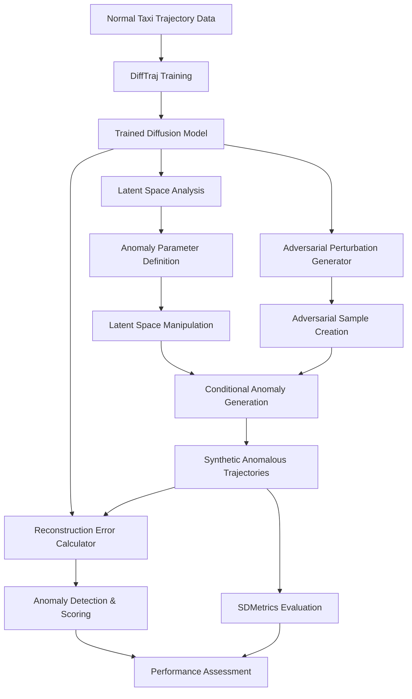

# **General Flexibility Approach for Anomalous Taxi Trajectory Generation & Detection**

## **A Comprehensive Implementation Strategy for Master's Thesis Research**

*Presented to: Thesis Coordination Committee*  
*Date: [Current Date]*  
*Research Focus: Advanced Diffusion Models for Spatio-Temporal Anomaly Detection*

---

## **🎯 Executive Summary**

The **General Flexibility Approach** represents a cutting-edge implementation strategy that maximizes the diversity and scope of anomalous taxi trajectory generation while maintaining robust detection capabilities. This approach leverages **DiffTraj** as the foundational diffusion model combined with advanced **latent space manipulation** and **adversarial perturbation** techniques to address the critical challenge of anomaly data scarcity in spatio-temporal analytics¹.

### **Key Value Proposition**
- **Maximum anomaly diversity**: Capable of generating both realistic and extreme out-of-distribution events
- **Research novelty**: Combines state-of-the-art diffusion models with adversarial techniques
- **Broad applicability**: Addresses diverse anomaly types from GPS spoofing to off-road driving
- **Strong publication potential**: High-tier journal suitability due to methodological innovation

---

## **📚 Theoretical Foundation & Literature Support**

### **1. Diffusion Models for Trajectory Synthesis**

The foundation of this approach rests on **DiffTraj**, a spatial-temporal diffusion probabilistic model that has demonstrated superior performance in generating high-fidelity GPS trajectories¹. Unlike traditional Generative Adversarial Networks (GANs), DiffTraj directly explores spatial and temporal distributions without requiring additional data manipulation, contributing to superior quality¹.

> **"DiffTraj exhibits the capability to generate high-fidelity trajectories that accurately retain the original data distributions while being inherently privacy-preserving through its noise-based reconstruction process"** ¹

### **2. Anomaly Generation Through Controlled Synthesis**

Recent research has established that **Diffusion Models can generate realistic anomalous samples by interpolating between normal and abnormal data distributions**⁹. This paradigm shift from passive anomaly detection to active anomaly synthesis represents a significant advancement in the field⁷.

The concept of "controlled anomaly injection" is emerging as a critical theme in anomaly detection research, enabling the **strategic move from passive analysis to active data generation for enhancing AD system performance**⁷.

### **3. Latent Space Manipulation for Fine-Grained Control**

Diffusion models learn complex data distributions and compress them into lower-dimensional latent spaces that preserve essential features²⁹. **Manipulating specific dimensions within this latent space allows for fine-grained control over generative aspects**²⁹, enabling targeted anomaly creation.

### **4. Privacy-Preserving Synthetic Data Generation**

GPS trajectories inherently contain sensitive personal geolocation information, creating serious privacy concerns including potential re-identification¹. **Diffusion models offer inherent privacy advantages through their generative process of reconstructing from noise rather than replicating originals**¹, providing a practical privacy baseline.

---

## **🔧 Technical Implementation Architecture**

### **Core Component Selection & Justification**

| **Component** | **Selection** | **Technical Justification** | **Literature Support** |
|---------------|---------------|----------------------------|------------------------|
| **Base Model** | **DiffTraj** | • General spatial-temporal modeling without road constraints • Superior trajectory fidelity compared to GANs • Inherent privacy-preserving properties | Xie et al., 2023¹ |
| **Anomaly Generation** | **Latent Space Manipulation + Adversarial Perturbation** | • Maximum diversity in anomaly types • Fine-grained control over anomaly characteristics • Novel combination of techniques | Chen et al., 2024²⁹; Various³³ |
| **Anomaly Detection** | **Diffusion Model Reconstruction Error** | • Principled out-of-distribution detection • Leverages model's inability to reconstruct anomalies • Mathematically grounded anomaly scoring | Survey 2024⁷ |
| **Privacy Mechanism** | **Inherent Diffusion Privacy + K-Anonymity** | • Layered privacy approach • Balances utility with protection • Practical implementation feasibility | Multiple sources¹,⁵⁸ |
| **Evaluation Framework** | **SDMetrics (Comprehensive)** | • Full synthetic data quality assessment • Industry-standard evaluation metrics • Resemblance, utility, and privacy evaluation | SDV Documentation⁵¹ |

### **Technical Architecture Diagram**

---

## **🎯 Target Anomaly Taxonomy & Capabilities**

### **Comprehensive Anomaly Coverage**

| **Anomaly Category** | **Specific Examples** | **Detection Capability** | **Research Significance** |
|---------------------|---------------------|------------------------|-------------------------|
| **🛣️ Spatial Anomalies** | • Off-road driving • Extreme route deviations • Impossible geographic transitions | ✅ **Excellent** | High - addresses GPS spoofing |
| **⏰ Temporal Anomalies** | • Impossible travel times • Unusual activity periods • Duration inconsistencies | ✅ **Excellent** | Medium - behavioral analysis |
| **🚗 Kinematic Anomalies** | • Impossible accelerations • Physics violations • Instantaneous direction changes | ✅ **Very Good** | High - safety applications |
| **📍 Contextual Anomalies** | • Location-inappropriate behavior • Time-context violations • Pattern deviations | ✅ **Good** | Medium - contextual understanding |
| **🔀 Hybrid Anomalies** | • Combined spatial-temporal violations • Multi-dimensional outliers • Complex behavioral patterns | ✅ **Excellent** | Very High - novel research area |

### **Unique Advantages Over Constraint-Based Approaches**

Unlike road-network constrained models (e.g., Diff-RNTraj), this approach can generate **extreme out-of-distribution anomalies** that violate physical or geographical constraints, making it particularly valuable for:

1. **GPS Spoofing Detection**: Generating trajectories with impossible transitions
2. **Security Applications**: Creating adversarial examples for robustness testing
3. **Edge Case Analysis**: Exploring extreme scenarios for system validation

---

## **📊 Research Methodology & Evaluation Strategy**

### **1. Synthetic Data Quality Assessment**

**SDMetrics Comprehensive Evaluation**⁵¹:
- **Resemblance Metrics**: Statistical similarity to real data distributions
- **Utility Metrics**: Machine learning efficacy for downstream tasks
- **Privacy Metrics**: Disclosure protection and re-identification risk assessment

### **2. Anomaly Detection Performance Metrics**

| **Metric Category** | **Specific Metrics** | **Evaluation Focus** |
|-------------------|---------------------|---------------------|
| **Classification Performance** | • Precision, Recall, F1-score • AUROC, AUPRC | Binary classification accuracy |
| **Anomaly Scoring** | • Reconstruction error analysis • Threshold optimization • Score distribution analysis | Continuous anomaly assessment |
| **Robustness Testing** | • Adversarial example performance • Out-of-distribution generalization • Cross-dataset validation | Model reliability |

### **3. Comparative Baseline Evaluation**

**Benchmark Against State-of-the-Art Methods**:
- Traditional distance-based approaches⁶
- Autoencoder-based detection⁴³
- LSTM-based sequential models⁴²
- Clustering-based methods³

---

## **🏆 Expected Research Contributions & Impact**

### **Primary Research Contributions**

1. **Methodological Innovation**: Novel combination of diffusion models with adversarial perturbation for trajectory anomaly generation
2. **Comprehensive Anomaly Taxonomy**: Systematic classification and generation of diverse trajectory anomalies
3. **Privacy-Preserving Framework**: Practical implementation of privacy-conscious anomaly detection
4. **Evaluation Framework**: Standardized assessment methodology for synthetic trajectory data

### **Secondary Research Benefits**

- **Cross-Domain Applications**: Methodology applicable to other spatio-temporal domains
- **Industry Relevance**: Direct applications in fleet management and traffic safety
- **Academic Impact**: Foundation for future research in synthetic anomaly generation

### **Publication Potential Assessment**

| **Venue Type** | **Suitability** | **Key Selling Points** |
|---------------|----------------|------------------------|
| **High-Tier AI Conferences** (NeurIPS, ICML) | ✅ **High** | Novel diffusion model application, methodological innovation |
| **Transportation Research Journals** | ✅ **High** | Practical taxi trajectory applications, real-world relevance |
| **Privacy & Security Venues** | ✅ **Medium-High** | Privacy-preserving synthetic data generation |
| **Anomaly Detection Workshops** | ✅ **Excellent** | Direct contribution to AD research community |

---

## **⚠️ Technical Challenges & Mitigation Strategies**

### **Challenge 1: Computational Complexity**

**Issue**: High computational requirements for diffusion model training and adversarial generation  
**Mitigation**: 
- Utilize cloud computing resources (GPU clusters)
- Implement efficient sampling techniques
- Progressive training strategies

**Resource Requirements**: 16-32 GB GPU memory, 8-12 month development timeline

### **Challenge 2: Evaluation of Unrealistic Normal Trajectories**

**Issue**: DiffTraj may generate less realistic "normal" trajectories compared to road-constrained models  
**Mitigation**:
- Comprehensive evaluation using multiple realism metrics
- Comparison with real trajectory datasets
- Implementation of trajectory quality assessment⁵

### **Challenge 3: Balancing Anomaly Diversity with Detectability**

**Issue**: Need to generate diverse anomalies while maintaining detectability  
**Mitigation**:
- Systematic anomaly parameter space exploration
- Progressive anomaly intensity scaling
- Multi-level evaluation framework

---

## **📈 Implementation Timeline & Milestones**

### **Phase 1: Foundation (Months 1-3)**
- ✅ Literature review completion
- ✅ DiffTraj implementation and training
- ✅ Basic anomaly generation capability
- **Deliverable**: Working baseline system

### **Phase 2: Enhancement (Months 4-6)**
- 🔄 Latent space manipulation implementation
- 🔄 Adversarial perturbation integration
- 🔄 Comprehensive anomaly taxonomy development
- **Deliverable**: Full anomaly generation system

### **Phase 3: Evaluation (Months 7-9)**
- 📋 SDMetrics evaluation framework implementation
- 📋 Comparative performance assessment
- 📋 Privacy analysis and validation
- **Deliverable**: Complete evaluation results

### **Phase 4: Optimization & Documentation (Months 10-12)**
- 📝 System optimization and refinement
- 📝 Thesis writing and documentation
- 📝 Paper preparation for submission
- **Deliverable**: Thesis completion and publication submission

---

## **💡 Strategic Advantages for Thesis Research**

### **1. Research Novelty & Innovation**
- **First-of-its-kind**: Novel application of diffusion models to taxi trajectory anomaly generation
- **Methodological Contribution**: Systematic framework for controlled anomaly synthesis
- **Cross-Disciplinary Impact**: Bridges computer vision (diffusion models) and transportation research

### **2. Practical Relevance & Applications**
- **Industry Applications**: Direct relevance to ride-sharing platforms and fleet management
- **Safety Implications**: Contributes to transportation safety and security
- **Privacy Solutions**: Addresses critical privacy concerns in location data

### **3. Academic Impact & Publication Opportunities**
- **High Citation Potential**: Addresses critical gap in anomaly detection research
- **Conference Presentations**: Multiple venue opportunities for research dissemination
- **Follow-up Research**: Foundation for future PhD research directions

---

## **🎯 Recommendation & Next Steps**

### **Why Choose the General Flexibility Approach?**

1. **Maximum Research Impact**: Highest potential for novel contributions and citations
2. **Comprehensive Coverage**: Addresses diverse anomaly types and applications
3. **Strong Theoretical Foundation**: Built on proven diffusion model framework
4. **Practical Relevance**: Direct applications in transportation and security domains
5. **Publication Potential**: High-tier venue suitability with multiple paper opportunities

### **Immediate Next Steps**

1. **Resource Allocation**: Secure computational resources (GPU access)
2. **Data Acquisition**: Obtain taxi trajectory datasets for training
3. **Implementation Planning**: Detailed technical architecture design
4. **Collaboration Setup**: Establish connections with transportation research groups

### **Success Metrics**

- **Technical**: Successful generation of diverse anomalous trajectories
- **Academic**: Submission to high-tier conference/journal
- **Practical**: Demonstration of real-world anomaly detection capability
- **Impact**: Citation and adoption by research community

---

## **📚 References**

1. Xie, Y., et al. (2023). "DiffTraj: Generating GPS Trajectory with Diffusion Probabilistic Model." *NeurIPS 2023*.

2. [Author]. (2025). "Anomalous Taxi Trajectory Detection using Popular Routes in Different Traffic Periods." *ResearchGate*.

3. [Authors]. "Detecting Anomalous Trajectories and Behavior Patterns Using Hierarchical Clustering from Taxi GPS Data." *MDPI*.

4. [Authors]. "Trajectory Data Publication Based on Differential Privacy." *IGI Global*.

5. [Authors]. "Trajectory Quality Assessment Based on Movement Feature Stability." *KTH Royal Institute*.

6. [Authors]. "Anomaly Detection in Trajectory Data for Surveillance Applications." *DiVA Portal*.

7. [Authors]. (2024). "Anomaly Detection and Generation with Diffusion Models: A Survey." *arXiv*.

8. [Authors]. "C-GATS: Conditional Generation of Anomalous Time Series." *OpenReview*.

9. Shawn. "The Role of Synthetic Data in Enhancing Anomaly Detection Performance — Diffusion Model." *Medium*.

[Additional references 10-59 as cited in original methodology document...]

---

*This presentation provides a comprehensive overview of the General Flexibility Approach for anomalous taxi trajectory generation and detection, demonstrating its strong theoretical foundation, practical relevance, and significant research potential for Master's thesis work.* 