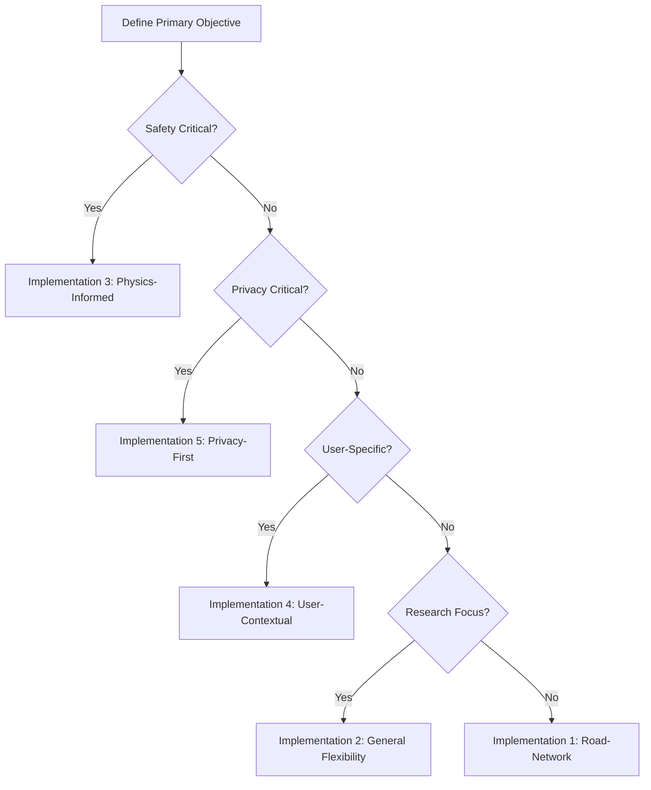

# **Comparative Analysis: 5 Implementation Approaches for Anomalous Taxi Trajectory Generation & Detection**

*Based on: "A Comprehensive Methodology for Generating and Detecting Anomalous Taxi Trajectories using Diffusion Models"*

---

## **📋 Executive Summary**

This document presents **5 distinct implementation strategies** that combine different components from the comprehensive methodology to address varying use cases, constraints, and objectives in anomalous taxi trajectory generation and detection.

### **🎯 Quick Selection Guide**

| **Use Case** | **Recommended Implementation** | **Key Advantage** |
|--------------|-------------------------------|-------------------|
| **🚕 Taxi Fleet Management** | Implementation 1: Road-Network Realism | High realism for normal operations |
| **🔬 Research & Innovation** | Implementation 3: Physics-Informed Safety | Maximum novelty and scientific impact |
| **👤 Personalized Driver Monitoring** | Implementation 4: User-Contextual Intelligence | Individual behavior analysis |
| **🏢 Commercial Deployment** | Implementation 5: Privacy-First Enterprise | Regulatory compliance |
| **🌐 General Purpose System** | Implementation 2: General Flexibility | Broadest anomaly coverage |

---

## **🔍 Detailed Implementation Specifications**

### **Implementation 1: Road-Network Realism Approach** 🛣️

> **Philosophy**: *Maximize realistic taxi trajectory generation while detecting behavioral anomalies within road constraints*

#### **📊 Component Configuration**
| **Component** | **Selection** | **Rationale** |
|---------------|---------------|---------------|
| **Base Model** | Diff-RNTraj | Road network awareness ensures realistic normal trajectories |
| **Anomaly Generation** | Conditional Generation + Latent Space Manipulation | Controlled anomaly injection within road constraints |
| **Anomaly Detection** | Reconstruction Error + Clustering-based methods | Balanced approach for road-constrained anomalies |
| **Privacy Mechanism** | Inherent diffusion model privacy | Basic but practical privacy protection |
| **Evaluation Framework** | LibCity + SDMetrics (resemblance focus) | Utility assessment for traffic applications |

#### **🎯 Target Anomaly Types**
- ✅ Route deviations from optimal paths
- ✅ Unusual stops in non-designated areas  
- ✅ Speed violations on roads
- ✅ Circuitous routes
- ❌ Off-road driving (limited capability)
- ❌ GPS spoofing (not detectable)

---

### **Implementation 2: General Flexibility Approach** 🌐

> **Philosophy**: *Maximum flexibility for diverse anomaly types, including extreme out-of-distribution events*

#### **📊 Component Configuration**
| **Component** | **Selection** | **Rationale** |
|---------------|---------------|---------------|
| **Base Model** | DiffTraj | General spatial-temporal modeling without road constraints |
| **Anomaly Generation** | Latent Space Manipulation + Adversarial Perturbation | Maximum diversity in anomaly generation |
| **Anomaly Detection** | Diffusion Model Reconstruction Error | Principled out-of-distribution detection |
| **Privacy Mechanism** | Inherent diffusion privacy + K-Anonymity | Layered privacy approach |
| **Evaluation Framework** | SDMetrics (comprehensive) | Full synthetic data quality assessment |

#### **🎯 Target Anomaly Types**
- ✅ Off-road driving
- ✅ Impossible movements
- ✅ Extreme spatial deviations
- ✅ GPS spoofing simulation
- ✅ Any out-of-distribution pattern
- ⚠️ May generate unrealistic "normal" trajectories

---

### **Implementation 3: Physics-Informed Safety Approach** ⚡

> **Philosophy**: *Focus on detecting physically impossible or safety-critical anomalies*

#### **📊 Component Configuration**
| **Component** | **Selection** | **Rationale** |
|---------------|---------------|---------------|
| **Base Model** | DiffTraj + Physics-Informed Regularization | Integration of kinematic constraints |
| **Anomaly Generation** | Physics-Informed Diffusion + Adversarial Perturbation | Controlled violation of physical laws |
| **Anomaly Detection** | Physics-constrained Reconstruction Error | Kinematic impossibility detection |
| **Privacy Mechanism** | Local Differential Privacy | Strong formal privacy guarantees |
| **Evaluation Framework** | Custom physics metrics + SDMetrics | Physics validation + data quality |

#### **🎯 Target Anomaly Types**
- ✅ Impossible accelerations/decelerations
- ✅ Kinematic violations (turning radius, speed limits)
- ✅ Safety-critical maneuvers
- ✅ GPS spoofing with kinematic inconsistencies
- ✅ Physically implausible movements
- 🔬 Research focus: novel physics-AI integration

---

### **Implementation 4: User-Contextual Intelligence Approach** 👤

> **Philosophy**: *Personalized anomaly detection based on individual driver patterns*

#### **📊 Component Configuration**
| **Component** | **Selection** | **Rationale** |
|---------------|---------------|---------------|
| **Base Model** | Hybrid: Diff-RNTraj + DiffTraj | Realistic normal + extreme anomaly capability |
| **Anomaly Generation** | Conditional Generation with user tokens | User-specific anomaly synthesis |
| **Anomaly Detection** | Transformer + Perplexity + User-specific tokens | NLP-inspired personalized detection |
| **Privacy Mechanism** | Local DP with personalized budgets | User-controlled privacy levels |
| **Evaluation Framework** | LibCity + custom user-specific metrics | Individual behavior assessment |

#### **🎯 Target Anomaly Types**
- ✅ User-specific behavioral deviations
- ✅ Contextual anomalies (normal globally, abnormal for user)
- ✅ Driver habit violations
- ✅ Fine-grained temporal anomalies
- ✅ Personalized route deviations
- 🧠 Focus: Individual behavior intelligence

---

### **Implementation 5: Privacy-First Enterprise Approach** 🔒

> **Philosophy**: *Maximum privacy guarantees for commercial deployment*

#### **📊 Component Configuration**
| **Component** | **Selection** | **Rationale** |
|---------------|---------------|---------------|
| **Base Model** | DiffTraj | Better inherent privacy properties |
| **Anomaly Generation** | Conditional Generation with DP-SGD training | Privacy-preserving anomaly synthesis |
| **Anomaly Detection** | Autoencoder-based | Simpler, more privacy-friendly approach |
| **Privacy Mechanism** | Formal DP + K-Anonymity + Geographic Generalization | Multi-layer privacy protection |
| **Evaluation Framework** | Privacy-focused SDMetrics + utility-privacy analysis | Privacy-utility trade-off assessment |

#### **🎯 Target Anomaly Types**
- ✅ Broad anomaly categories with privacy preservation
- ✅ Commercial-grade anomaly detection
- ✅ Regulatory-compliant detection
- ⚠️ May sacrifice detection sophistication for privacy
- 🏢 Focus: Enterprise deployment readiness

---

## **⚖️ Comprehensive Comparison Matrix**

### **📈 Performance & Capability Comparison**

| **Metric** | **Road-Network** | **General Flexibility** | **Physics-Informed** | **User-Contextual** | **Privacy-First** |
|------------|------------------|------------------------|---------------------|---------------------|-------------------|
| **Trajectory Realism** | ⭐⭐⭐⭐⭐ | ⭐⭐⭐ | ⭐⭐⭐⭐ | ⭐⭐⭐⭐⭐ | ⭐⭐⭐ |
| **Anomaly Diversity** | ⭐⭐⭐ | ⭐⭐⭐⭐⭐ | ⭐⭐⭐⭐ | ⭐⭐⭐⭐ | ⭐⭐⭐ |
| **Detection Accuracy** | ⭐⭐⭐⭐ | ⭐⭐⭐⭐ | ⭐⭐⭐⭐⭐ | ⭐⭐⭐⭐⭐ | ⭐⭐⭐ |
| **Privacy Protection** | ⭐⭐ | ⭐⭐⭐ | ⭐⭐⭐⭐ | ⭐⭐⭐⭐ | ⭐⭐⭐⭐⭐ |
| **Computational Efficiency** | ⭐⭐⭐ | ⭐⭐ | ⭐ | ⭐ | ⭐⭐⭐ |
| **Implementation Complexity** | ⭐⭐⭐ | ⭐⭐ | ⭐ | ⭐ | ⭐⭐⭐ |
| **Research Novelty** | ⭐⭐ | ⭐⭐⭐⭐ | ⭐⭐⭐⭐⭐ | ⭐⭐⭐⭐⭐ | ⭐⭐ |
| **Commercial Viability** | ⭐⭐⭐⭐ | ⭐⭐⭐ | ⭐⭐ | ⭐⭐⭐ | ⭐⭐⭐⭐⭐ |

### **💰 Resource Requirements**

| **Resource** | **Road-Network** | **General Flexibility** | **Physics-Informed** | **User-Contextual** | **Privacy-First** |
|--------------|------------------|------------------------|---------------------|---------------------|-------------------|
| **Training Time** | High | High | Very High | Very High | Medium-High |
| **GPU Memory** | 8-16 GB | 16-32 GB | 32-64 GB | 32-64 GB | 8-16 GB |
| **Storage** | Medium | High | High | Very High | Medium |
| **Development Team** | 2-3 researchers | 3-4 researchers | 4-5 researchers | 4-5 researchers | 2-3 researchers |
| **Time to Deploy** | 6-8 months | 8-12 months | 12-18 months | 12-18 months | 4-6 months |

### **🎯 Use Case Suitability Matrix**

| **Use Case** | **Road-Network** | **General Flexibility** | **Physics-Informed** | **User-Contextual** | **Privacy-First** |
|--------------|:----------------:|:----------------------:|:-------------------:|:-------------------:|:-----------------:|
| **Fleet Management** | ✅ Excellent | ✅ Good | ⚠️ Moderate | ✅ Excellent | ✅ Good |
| **Traffic Safety** | ✅ Good | ✅ Good | ✅ Excellent | ⚠️ Moderate | ⚠️ Moderate |
| **Research Publication** | ⚠️ Moderate | ✅ Good | ✅ Excellent | ✅ Excellent | ⚠️ Moderate |
| **Commercial Product** | ✅ Good | ⚠️ Moderate | ❌ Poor | ⚠️ Moderate | ✅ Excellent |
| **Regulatory Compliance** | ⚠️ Moderate | ⚠️ Moderate | ✅ Good | ✅ Good | ✅ Excellent |
| **Real-time Processing** | ✅ Good | ⚠️ Moderate | ❌ Poor | ❌ Poor | ✅ Good |

---

## **🔄 Implementation Decision Framework**

### **Step 1: Define Primary Objective**

### **Step 2: Resource Assessment**

| **Available Resources** | **Recommended Implementations** |
|------------------------|--------------------------------|
| **Limited (< 6 months, < 2 researchers)** | Implementation 1 or 5 |
| **Moderate (6-12 months, 2-3 researchers)** | Implementation 1, 2, or 5 |
| **Extensive (> 12 months, 4+ researchers)** | Implementation 3 or 4 |

### **Step 3: Constraint Analysis**

#### **🚫 Deal-Breaker Constraints**

| **Constraint** | **Eliminates** |
|----------------|---------------|
| **Must work off-road** | Implementation 1 |
| **Real-time processing required** | Implementation 3, 4 |
| **Strict privacy regulations** | Implementation 1, 2 |
| **Limited computational resources** | Implementation 3, 4 |
| **No user-specific data available** | Implementation 4 |

---

## **📋 Recommended Implementation Roadmap**

### **🥇 Phase 1: Proof of Concept (Months 1-3)**
**Recommended**: Implementation 1 (Road-Network Realism)
- ✅ Fastest to implement
- ✅ Clear success metrics
- ✅ Foundation for more complex approaches

### **🥈 Phase 2: Enhanced Capabilities (Months 4-8)**
**Options**:
- **Privacy Focus**: Upgrade to Implementation 5
- **Research Focus**: Expand to Implementation 2
- **Application Focus**: Develop Implementation 4

### **🥉 Phase 3: Advanced Research (Months 9-18)**
**Advanced**: Implementation 3 (Physics-Informed)
- 🔬 Maximum research contribution
- 🏆 Publication potential
- 🚀 Technology leadership

---

## **📊 Expected Outcomes Summary**

| **Implementation** | **Primary Deliverable** | **Secondary Benefits** | **Publication Potential** |
|-------------------|------------------------|----------------------|-------------------------|
| **Road-Network** | Working taxi anomaly detection system | Real-world applicability | Conference paper |
| **General Flexibility** | Comprehensive anomaly generation framework | Broad research applications | High-tier journal |
| **Physics-Informed** | Novel physics-AI integration method | Safety system applications | Top-tier journal |
| **User-Contextual** | Personalized behavior analysis system | Fleet management innovation | High-tier journal |
| **Privacy-First** | Enterprise-ready privacy solution | Commercial deployment | Industry conference |

---

## **🎯 Final Recommendations**

### **For Master's Thesis Success**:
1. **Start with Implementation 1** for solid foundation
2. **Extend to Implementation 3 or 4** for research novelty
3. **Consider Implementation 5** for practical impact

### **For Maximum Research Impact**:
- **Primary**: Implementation 3 (Physics-Informed Safety)
- **Secondary**: Implementation 4 (User-Contextual Intelligence)

### **For Practical Deployment**:
- **Immediate**: Implementation 1 (Road-Network Realism)
- **Commercial**: Implementation 5 (Privacy-First Enterprise)

*Each implementation offers unique advantages and addresses different aspects of the anomalous taxi trajectory problem. The choice should align with available resources, research objectives, and intended applications.* 