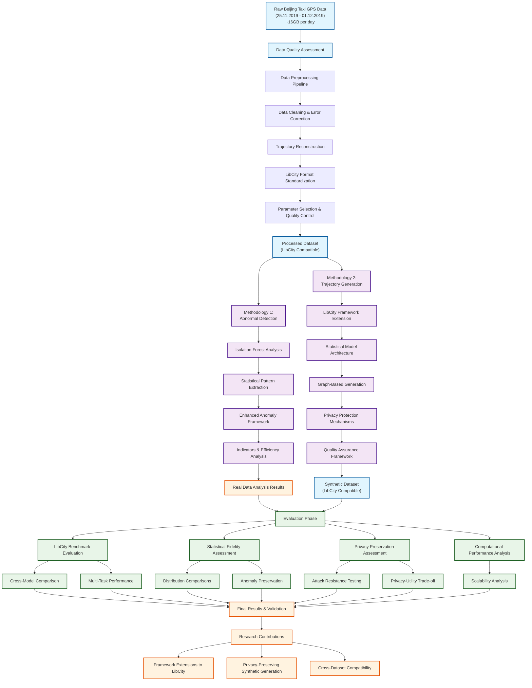

# Thesis Process Flowchart

## Overview
This diagram visualizes the complete research process as outlined in the main thesis document (main.tex), showing the flow from raw data through methodology implementation to final evaluation and results.

## Mermaid Diagram Code

## Process Flow Description

### 1. Data Pipeline (Light Blue Nodes)
- **Raw Data**: Beijing taxi GPS data (25.11.2019 - 01.12.2019, ~16GB/day)
- **Quality Assessment**: Initial data validation and analysis
- **Processed Dataset**: LibCity-compatible standardized data format

### 2. Dual Methodology (Purple Nodes)
- **Methodology 1**: Isolation forest-based abnormal detection with pattern extraction
- **Methodology 2**: LibCity framework extension for synthetic trajectory generation

### 3. Evaluation Framework (Green Nodes)
- **LibCity Integration**: Leveraging existing benchmarks and evaluation tools
- **Multi-dimensional Assessment**: Statistical, privacy, and performance evaluation
- **Cross-validation**: Comparison with other models and datasets

### 4. Research Outcomes (Orange Nodes)
- **Framework Extensions**: Contributions to LibCity ecosystem
- **Privacy-Preserving Generation**: Novel synthetic data creation methods
- **Cross-Dataset Compatibility**: Standardized approach for broader research use

## Key Features

- **LibCity Integration**: Framework serves as backbone throughout entire process
- **Privacy by Design**: Protection mechanisms integrated into methodology, not added post-hoc
- **Comprehensive Evaluation**: Multi-faceted assessment using established benchmarks
- **Research Reproducibility**: Standardized formats enable comparison and replication
- **Extensibility**: Framework designed for use with multiple datasets and tasks

## File Information
- **Created**: Generated from main.tex thesis structure
- **Purpose**: Visual representation of complete research methodology
- **Usage**: Reference for understanding overall process flow and component relationships 