# Distilling LM‑TAD into HOSER at Training Time

> **TL;DR**: Transfer spatial knowledge from a trajectory anomaly detection model (LM-TAD) into a fast trajectory prediction model (HOSER) during training. LM-TAD learned what "normal" trajectories look like; we repurpose those learned patterns to improve HOSER's predictions without any inference overhead.

## Glossary of Key Terms

**Knowledge Distillation**: A machine learning technique where a smaller "student" model learns to mimic a larger "teacher" model by matching the teacher's output probability distributions, not just hard labels.

**Teacher Model (LM-TAD)**: Pre-trained anomaly detection model (originally outputs perplexity scores) repurposed to provide "soft" probability distributions over possible next locations. Frozen means its weights never change during distillation.

**Student Model (HOSER)**: The model being trained. It learns from both ground truth labels (hard targets) and teacher distributions (soft targets).

**KL Divergence (Kullback-Leibler)**: A mathematical measure of how different two probability distributions are. Used as a loss term to make student distribution similar to teacher distribution.

**Temperature (τ)**: A softmax parameter that "smooths" probability distributions. Higher τ → more uniform (flatter) distribution, emphasizing low-probability options. Lower τ → sharper (peakier) distribution.

**Candidate Set**: For each timestep, HOSER considers only a subset of all possible roads (typically top-64 by spatial score). Distillation happens only over this candidate set.

**Sliding Window**: Teacher only sees the last N road IDs in the trajectory (controlled by `distill_window` hyperparameter). This limits computation and focuses on recent context.

**AMP (Automatic Mixed Precision)**: Uses float16 for most computations, float32 for critical operations. Reduces GPU memory usage by ~50% with minimal accuracy impact.

**Optuna**: Hyperparameter optimization framework that intelligently explores parameter combinations using Bayesian methods (CmaEsSampler) and early stopping (HyperbandPruner).

**WandB (Weights & Biases)**: Experiment tracking platform that logs metrics, hyperparameters, and model artifacts for comparison and visualization.

**Road Network**: Graph of 40,060 road segments in Beijing. Each road has an ID, centroid coordinates, and connections to other roads.

**Grid Cells**: LM-TAD's spatial representation. Beijing area is divided into 51,663 fine-grained grid cells. Each cell has a unique token ID.

**Vocabulary Mismatch**: HOSER predicts road IDs (40k vocabulary), LM-TAD predicts grid cell tokens (51k vocabulary). We bridge this by mapping road centroids → grid cells.

## Introduction

### The Problem: Map-Matched Trajectory Prediction

**Task**: Given a partial GPS trajectory (sequence of roads traveled) and a destination, predict which road segment a vehicle will take next.

- **Input**: Historical sequence of road IDs + destination road ID
- **Output**: Probability distribution over candidate next roads
- **Application**: Route prediction for navigation systems, autonomous vehicles, traffic forecasting, and taxi dispatch optimization

**Dataset**: Beijing taxi GPS trajectories (629,380 training samples, 89,912 validation samples) covering 40,060 road segments in the road network.

### The Models

#### HOSER (Hierarchical One-Shot Embedding and Routing)
**Our fast, production-ready model**

- **Architecture**: Hierarchical spatial reasoning using 300 learned zones + Graph Neural Network (GCN) + attention-based navigator
- **Speed**: ~10-12 it/s (iterations per second) = ~13ms per batch
- **Baseline accuracy**: 57.2% (next-step prediction accuracy on validation set)
- **Strength**: Fast enough for real-time deployment, hierarchical design captures macro-level spatial patterns
- **Limitation**: Lower accuracy than state-of-the-art models

#### LM-TAD (Language Model for Trajectory Anomaly Detection)
**State-of-the-art anomaly detection model repurposed as teacher**

- **Original purpose**: Trajectory anomaly detection via perplexity and surprisal metrics ([Mbuya et al., SIGSPATIAL 2024](https://arxiv.org/pdf/2409.15366))
- **Architecture**: Transformer-based autoregressive causal-attention model operating on 51,663 fine-grained grid cells
- **How we use it**: Repurpose the learned probability distributions for distillation (extract next-token probabilities instead of perplexity scores)
- **Speed**: ~1.6-1.8 it/s = ~430ms per batch (teacher forward pass dominates)
- **Strength**: Learned rich spatial transition patterns from grid-based trajectory representation
- **Limitation**: 25-30× slower than HOSER, designed for anomaly detection not real-time prediction
- **Key insight**: A model trained to detect anomalies has learned what "normal" trajectories look like, making it an excellent teacher

### Why Distillation?

**The dilemma**: LM-TAD has learned excellent spatial patterns (for detecting anomalies), but it's too slow for real-time trajectory prediction.

**Traditional solutions** (all bad):
- ❌ Use LM-TAD directly → Wrong task (outputs perplexity, not predictions) and too slow (430ms latency)
- ❌ Retrain LM-TAD for prediction → Loses anomaly detection capability, still too slow
- ❌ Train HOSER harder → Already at baseline limit with supervised learning alone

**Our solution: Knowledge Distillation at Training Time**

Transfer LM-TAD's learned spatial patterns to HOSER during training, then deploy only HOSER at inference.

**Benefits**:
- ✅ **No inference overhead**: HOSER runs alone at inference (fast 13ms latency)
- ✅ **Better accuracy**: HOSER learns from both ground truth labels AND teacher's spatial reasoning
- ✅ **Simple deployment**: Single model, no teacher needed in production
- ✅ **Calibrated uncertainty**: HOSER learns not just *what* to predict, but *how confident* to be

**Key insight**: LM-TAD was trained to detect trajectory anomalies by learning what "normal" spatial patterns look like. These learned distributions encode rich spatial knowledge that we can transfer to HOSER through distillation, even though LM-TAD was never trained for trajectory prediction.

## Quick Start

**For impatient readers**: Want to run distillation training immediately? Here's the minimal path:

1. **Prerequisites** (one-time setup):
   ```bash
   # Export LM-TAD teacher weights (if not already done)
   uv run python tools/export_lmtad_weights.py \
     --checkpoint /path/to/lmtad_checkpoint.pth \
     --output teachers/lmtad_weights.pt
   ```

2. **Single training run** (vanilla baseline for comparison):
   ```bash
   uv run python train_with_distill.py \
     --dataset Beijing \
     --cuda 0 \
     --config config/Beijing.yaml \
     --data_dir /path/to/hoser_format
   ```

3. **Hyperparameter tuning** (recommended for best results):
   ```bash
   # Edit config/Beijing.yaml to set optuna.n_trials (12 recommended)
   uv run python tune_hoser.py --data_dir /path/to/hoser_format
   
   # Results will be in: optuna_results/<study_name>/best_trial/
   ```

4. **Evaluate results**:
   ```bash
   # Run evaluation pipeline
   cd hoser-distill-optuna-6
   ./run_gene_eval_pipeline.sh --num-gene 100 --seed 42
   
   # View in WandB dashboard
   # https://wandb.ai/<your_entity>/hoser-distill-optuna-6
   ```

**Expected outcomes**:
- Vanilla baseline: ~57.2% next-step accuracy (8 epochs, ~2 hours)
- Distilled model: Target >58% accuracy (requires hyperparameter tuning)
- Training speed: ~1.6-1.8 it/s (distilled), ~10-12 it/s (vanilla)
- Evaluation: Better trajectory metrics on test OD pairs (generalization)

**What to read next**:
- Understand the approach → Read "Executive Summary" and "Loss Design"
- Configure hyperparameters → Read "Hyperparameter Tuning with Optuna"
- Debug performance → Read "Recent Performance & Stability Improvements"
- Deep understanding → Read "Detailed Worked Example"

## Executive Summary

We propose a training‑time distillation approach where a frozen (pre-trained, weights-locked) LM‑TAD model (teacher) provides learned spatial priors for next‑step decisions. HOSER (student) is trained to align its candidate road distribution to the teacher's distribution while keeping HOSER's original supervised objectives intact. This removes the need to co‑run LM‑TAD at inference time, keeping deployment simple and fast while capturing LM‑TAD's behavioral knowledge.

**Key properties**:
- **No runtime overhead**: HOSER remains a single model at inference (teacher only used during training)
- **Frozen teacher**: LM-TAD weights are locked, never updated (ensures stable guidance signal)
- **Minimal architecture changes**: Add a teacher wrapper, road→grid token mapping, and KL divergence term to training loss
- **Tunable trade-offs**: Temperature (τ), KL weight (λ), and history window control compute/quality balance

## What's Implemented (Current Code)

### Core Components

#### `critics/lmtad_teacher.py` - Teacher Model Wrapper
**Purpose**: Provides frozen LM-TAD predictions without polluting the training environment

**What it does**:
- Loads pre-trained LM-TAD from weights-only export (`{'state_dict', 'model_config'}`)
- Provides vectorized next-token probability distributions (batched inference)
- Implements sliding window over historical trajectory (controlled by `distill_window` hyperparameter)
- Uses AMP (Automatic Mixed Precision) for GPU memory efficiency

**Why separate wrapper**: Avoids module import collisions between LM-TAD's dependencies and HOSER's codebase

#### `tools/export_lmtad_weights.py` - Model Export Utility
**Purpose**: Prepare LM-TAD for safe loading in the training environment

**What it does**:
- Exports LM-TAD checkpoints to pickle-free, weights-only format
- Strips out all code dependencies, keeping only state dict + model config
- Creates a portable `.pt` file that can be loaded without the original LM-TAD codebase

**Why needed**: LM-TAD and HOSER have conflicting dependencies; weights-only export avoids import errors

#### `critics/grid_mapper.py` - Spatial Mapping Utility
**Purpose**: Bridge the vocabulary gap between HOSER (roads) and LM-TAD (grid cells)

**What it does**:
- Vectorized road centroid → grid token mapper
- Precomputes `road_id → grid_token` lookup table using dataset spatial bounds and LM-TAD's grid parameters
- Enables efficient translation of teacher's grid-based predictions to HOSER's road-based candidates

**Why needed**: The two models use different spatial representations; this mapping is the "Rosetta Stone" for distillation

#### `critics/distill_hook.py` - Distillation Orchestrator
**Purpose**: Manages the complete distillation workflow during training

**What it does**:
1. **Teacher calls**: Invokes teacher model for each training sample
2. **Candidate mapping**: Maps teacher's grid-based logits to student's candidate road IDs
3. **Renormalization**: Ensures teacher probabilities sum to 1.0 over candidate set
4. **KL computation**: Computes batched KL divergence loss between student and teacher distributions

**Key design**: Handles variable-length trajectories and variable-size candidate sets per timestep

#### `train_with_distill.py` - Main Training Script
**Purpose**: Complete training pipeline with distillation, optimization, and logging

**What it includes**:
- **Distillation integration**: Wires `DistillationManager` into training loop
- **Performance optimizations**: 
  - AMP (Automatic Mixed Precision) for memory efficiency
  - `torch.compile` with max-autotune (CUDA graphs disabled for compatibility)
  - Gradient checkpointing to reduce memory footprint
  - Tuned DataLoader settings (workers, prefetch, pin_memory)
- **Training features**:
  - Per-epoch validation with accuracy and MAPE metrics
  - Combined loss: CrossEntropy + MAPE + λ·KL
  - Performance profiling (per-component timing breakdown)
  - Full WandB logging (hyperparameters, metrics, model artifacts)

**Combined loss formula**:
```
Total Loss = CrossEntropy(next_step) + α·MAPE(time) + λ·KL(student || teacher)
```

#### `config/Beijing.yaml` - Configuration Hub
**Purpose**: Single source of truth for all training settings (config-first design)

**Sections**:
- `distill`: Enable/disable, lambda, temperature, window
- `training`: Epochs, learning rate, warmup, batch size
- `dataloader`: Workers, prefetch factor, pin memory, persistent workers
- `data`: Dataset paths, candidate filtering (top-k)
- `profiling`: Performance logging intervals
- `wandb`: Project name, entity, run tags
- `optuna`: Hyperparameter search settings (sampler, pruner, trials)

**Why centralized**: Ensures reproducibility and makes hyperparameter tuning tractable

#### `dataset.py` - Smart Caching Data Loader
**Purpose**: Eliminate disk I/O bottleneck for large-scale training

**What it does**:
1. **RAM estimation**: Samples 100 files to estimate total dataset RAM footprint
2. **Availability check**: Queries available system RAM (using `psutil`)
3. **Smart decision**:
   - If dataset fits in 60% of available RAM → **parallel cache to RAM** using all CPU cores
   - Otherwise → **stream from disk** using efficient file handle management
4. **Parallel loading**: Uses `multiprocessing.Pool` to load hundreds of thousands of `.pt` files in parallel

**Performance impact**:
- Before: 50-400ms Data Wait (disk I/O bottleneck), performance cliffs mid-epoch
- After: ~5ms Data Wait (RAM-cached), stable 10-12 it/s throughout training

#### Generation and Evaluation Tools

**`gene.py`** - Trajectory Generation
- Loads distilled HOSER checkpoint via `--model_path`
- Generates predicted trajectories for test set
- Outputs predictions for evaluation

**`evaluation.py`** - Metrics Computation
- Computes global/local trajectory similarity metrics:
  - JSD (Jensen-Shannon Divergence) - distribution similarity
  - Hausdorff distance - spatial deviation
  - DTW (Dynamic Time Warping) - temporal alignment
- Logs all metrics to WandB for comparison

**`tools/collect_distill_artifacts.py`** - Results Packaging
- Converts generated trajectories to GeoJSON for visualization
- Bundles model checkpoints, evaluation metrics, and WandB metadata
- Creates shareable artifact package for thesis/publication

## Recent Performance & Stability Improvements

The implementation has been heavily optimized to handle large-scale training (629k samples) with stable throughput. The primary bottleneck—disk I/O from streaming hundreds of thousands of small files—has been eliminated.

**Performance notes** (example hardware: RTX 2080 Ti, 11GB VRAM, 64GB system RAM):
- **Vanilla baseline**: ~10–12 it/s with disk streaming (Data Wait ~50 ms). With RAM caching, Data Wait becomes negligible.
- **Distilled runs**: Dominated by teacher compute (~430 ms per step with window≈4), yielding ~1.6–1.8 it/s. RAM caching still helps, but teacher remains the bottleneck.
- **Data Wait** with RAM cache: typically <5% (all samples in memory).

> **Note**: These timings are hardware-dependent. Newer GPUs (RTX 30/40 series) with better FP16 performance will significantly speed up teacher inference. The smart RAM caching logic adapts to your available system memory automatically.

**Key optimizations**:
1. **Smart Parallel RAM Caching**: The ultimate fix. `dataset.py` now automatically detects if the dataset can fit into available system RAM. If so, it uses all available CPU cores to load the entire dataset into memory in parallel at startup, eliminating all disk I/O during training.
2. **Candidate top-k filtering** (64): Prevents collate bottleneck from pathological traces with 1000+ candidates.
3. **Optimized collate function**: Vectorized operations, reduced allocations, pre-cropped arrays.
4. **Fallback to Disk Streaming**: If the dataset is too large for RAM, it falls back to the previous optimized streaming mode (6 workers, `prefetch_factor=16`) which sustains ~11-13 it/s.
5. **Label remapping**: GPU-based vectorized remapping with `-100` masking for filtered positions.
6. **Loss masking**: Both cross_entropy and time loss properly handle invalid positions.
7. **File handle management**: Explicit context managers prevent descriptor exhaustion in streaming mode.

## Visual Overview

The diagrams below illustrate the complete distillation pipeline, from data loading through training to hyperparameter tuning. These provide a high-level view of how all components interact.

### Training & Distillation Data Flow

```mermaid
%%{init: {'theme':'base', 'themeVariables': { 'primaryColor':'#e8f5e9','primaryTextColor':'#1b5e20','primaryBorderColor':'#388e3c','lineColor':'#666','secondaryColor':'#e3f2fd','tertiaryColor':'#fff3e0'}}}%%
flowchart TB
  subgraph Data["📦 DATA PREPARATION"]
    direction TB
    A["🗂️ HOSER Dataset<br/><b>629,380 trajectories</b><br/>Beijing taxi GPS"]
    A --> B{"💾 RAM Check<br/>~13GB needed"}
    B -->|"✅ Sufficient"| C["⚡ Parallel Cache<br/><b>64 CPU cores</b><br/>~5 min load"]
    B -->|"❌ Limited"| D["📁 Disk Stream<br/><b>6 workers</b><br/>prefetch=16"]
  end

  subgraph Loader["🔧 BATCH ASSEMBLY & PREPROCESSING"]
    direction TB
    C --> E["📦 DataLoader<br/><b>batch_size = 64</b>"]
    D --> E
    E --> F["🔀 MyCollateFn<br/>vectorized ops<br/>GPU-optimized"]
    F --> G["✂️ Top-K Filter<br/><b>k = 64</b> candidates<br/>per timestep"]
    G --> H["🎯 Label Remap<br/>GPU vectorized<br/>ignore_index=-100"]
  end

  subgraph Student["🎓 STUDENT MODEL (Trainable)"]
    direction TB
    H --> I["🧠 HOSER Forward<br/><b>300 zones + GCN</b><br/>attention navigator"]
    I --> J["📊 Student Logits<br/>over k candidates<br/>temperature-scaled"]
    J --> K["⏱️ Time Head<br/>travel time pred<br/>MAPE loss"]
  end

  subgraph Teacher["❄️ TEACHER MODEL (Frozen)"]
    direction TB
    H --> L["🗺️ Road → Grid<br/><b>40,060 → 51,663</b><br/>precomputed map"]
    L --> M["🔒 LM-TAD Inference<br/><b>FP16 batched</b><br/>torch.no_grad()<br/>window=2-8"]
    M --> N["📈 Teacher Probs<br/><b>51,663 grid cells</b><br/>softmax output"]
    N --> O["🎯 Select & Renorm<br/>extract k candidates<br/>sum to 1.0"]
  end

  subgraph Losses["📊 LOSS COMPUTATION"]
    direction TB
    J --> P["📉 Cross-Entropy<br/><b>supervised</b><br/>to ground truth"]
    K --> Q["⏰ Time Loss<br/><b>MAPE</b><br/>masked invalid"]
    O --> R["🔄 KL Divergence<br/><b>distillation</b><br/>teacher → student"]
    P --> S["💥 Total Loss<br/><b>λ·KL + CE + MAPE</b><br/>λ ∈ [0.001, 0.1]"]
    Q --> S
    R --> S
    S --> T["⚡ Backprop<br/><b>GradScaler</b><br/>AdamW optimizer"]
  end

  subgraph Eval["📈 EVALUATION & LOGGING"]
    direction TB
    T --> U["📊 Metrics Logging<br/><b>TensorBoard + WandB</b><br/>loss, accuracy, MAPE"]
    T --> V["✅ Validation<br/><b>per epoch</b><br/>89,912 samples"]
    V --> W["💾 Save Checkpoint<br/><b>best val_acc</b><br/>model + config"]
  end

  %% Styling for frozen teacher (blue with dashed border)
  style L fill:#e1f5fe,stroke:#0277bd,stroke-width:2px
  style M fill:#b3e5fc,stroke:#01579b,stroke-width:4px,stroke-dasharray: 8 4
  style N fill:#e1f5fe,stroke:#0277bd,stroke-width:2px
  style O fill:#e1f5fe,stroke:#0277bd,stroke-width:2px
  
  %% Styling for trainable student (green)
  style I fill:#c8e6c9,stroke:#2e7d32,stroke-width:4px
  style J fill:#e8f5e9,stroke:#388e3c,stroke-width:2px
  style K fill:#e8f5e9,stroke:#388e3c,stroke-width:2px
  
  %% Styling for losses (orange → red gradient)
  style P fill:#ffe0b2,stroke:#e65100,stroke-width:2px
  style Q fill:#ffe0b2,stroke:#e65100,stroke-width:2px
  style R fill:#f8bbd0,stroke:#ad1457,stroke-width:3px
  style S fill:#ffcdd2,stroke:#c62828,stroke-width:4px
  
  %% Styling for data flow (purple)
  style A fill:#f3e5f5,stroke:#6a1b9a,stroke-width:2px
  style C fill:#e1bee7,stroke:#6a1b9a,stroke-width:2px
  style D fill:#e1bee7,stroke:#6a1b9a,stroke-width:2px
  
  %% Styling for preprocessing (yellow)
  style E fill:#fff9c4,stroke:#f57f17,stroke-width:2px
  style F fill:#fff9c4,stroke:#f57f17,stroke-width:2px
  style G fill:#fff59d,stroke:#f57f17,stroke-width:2px
  style H fill:#fff176,stroke:#f9a825,stroke-width:3px
  
  %% Styling for backprop (bright red)
  style T fill:#ef5350,stroke:#b71c1c,stroke-width:4px,color:#fff
  
  %% Styling for eval (teal)
  style U fill:#b2dfdb,stroke:#00695c,stroke-width:2px
  style V fill:#b2dfdb,stroke:#00695c,stroke-width:2px
  style W fill:#80cbc4,stroke:#00695c,stroke-width:3px
```



**Legend**:
- 🎓 **Green (Student)**: Trainable HOSER model — gradients flow, weights update
- ❄️ **Blue dashed (Teacher)**: Frozen LM-TAD model — 🔒 `no_grad()`, no weight updates
- 📦 **Purple (Data)**: Data loading and preprocessing pipeline
- 🔧 **Yellow (Processing)**: Batch assembly and candidate filtering
- 📊 **Orange/Red (Losses)**: Loss computation (supervised + distillation)
- 📈 **Cyan (Eval)**: Validation and artifact saving

### Optuna Tuning Loop (2‑Phase)

```mermaid
%%{init: {'theme':'base', 'themeVariables': { 'primaryColor':'#e8f5e9','primaryTextColor':'#1b5e20','primaryBorderColor':'#388e3c','lineColor':'#666'}}}%%
flowchart TB
  subgraph Search["🔬 PHASE 1: Hyperparameter Search<br/>⏱️ Duration: 3-4 days"]
    direction TB
    A0["🏁 <b>Trial 0: Vanilla Baseline</b><br/>no distillation<br/>λ = 0<br/>8 epochs"]
    A0 --> B0["📊 Baseline Result<br/><b>val_acc = 57.2%</b><br/>performance floor"]
    
    A["🔬 <b>CMA-ES Sampler</b><br/>Continuous optimization<br/><b>λ</b> ∈ [0.001, 0.1] log<br/><b>τ</b> ∈ [1.0, 5.0]<br/><b>window</b> ∈ [2, 8] int"]
    A --> B["⚙️ Create Config<br/>Trial N (N=1..12)<br/>seed = 42 + N"]
    B --> C["🎓 Train Distilled<br/><b>max 8 epochs</b><br/>~54 min/epoch<br/>~7.2h max"]
    C --> D["📈 Report Metrics<br/><b>val_acc per epoch</b><br/>to Optuna"]
    D --> E{"⚡ <b>Hyperband Pruner</b><br/>Evaluate at epoch 5<br/>min_resource = 5<br/>reduction_factor = 3"}
    E -->|"❌ Below median<br/>(~33% trials)"| F["🛑 <b>Prune Early</b><br/>stop training<br/>preserve artifacts<br/>save compute"]
    E -->|"✅ Above median<br/>(~67% trials)"| G["🎯 <b>Run to Completion</b><br/>finish 8 epochs<br/>preserve artifacts<br/>track best"]
    G --> H["🏆 Update Best<br/><b>best val_acc</b><br/>store hyperparams"]
    F --> H
    H --> I{"🔄 <b>Continue?</b><br/>trials completed"}
    I -->|"< 12 trials"| A
    I -->|"✓ 12 done"| J
  end

  subgraph Final["🚀 PHASE 2: Final Evaluation<br/>⏱️ Duration: ~1 day"]
    direction TB
    J["📋 <b>Load Best Config</b><br/>from Phase 1<br/>optimal λ, τ, window"]
    J --> K["🎓 <b>Train 25 Epochs</b><br/>Multiple seeds<br/><b>42, 43, 44</b><br/>~23h each<br/>full convergence"]
    K --> L["📊 <b>Aggregate Stats</b><br/>mean ± std<br/>val_acc, MAPE<br/>statistical test"]
    L --> M["✅ <b>Final Report</b><br/>compare vs baseline<br/>improvement %<br/>significance p-value"]
  end

  %% Styling for baseline (gray)
  style A0 fill:#e0e0e0,stroke:#424242,stroke-width:4px
  style B0 fill:#eeeeee,stroke:#616161,stroke-width:2px
  
  %% Styling for sampler (bright green)
  style A fill:#a5d6a7,stroke:#2e7d32,stroke-width:4px
  
  %% Styling for trial process (yellow gradient)
  style B fill:#fff59d,stroke:#f57f17,stroke-width:2px
  style C fill:#ffee58,stroke:#f9a825,stroke-width:3px
  style D fill:#e1f5fe,stroke:#0277bd,stroke-width:2px
  
  %% Styling for pruner (bright yellow, large)
  style E fill:#fff176,stroke:#f57f17,stroke-width:4px
  
  %% Styling for outcomes
  style F fill:#ffcdd2,stroke:#c62828,stroke-width:3px
  style G fill:#c8e6c9,stroke:#2e7d32,stroke-width:3px
  style H fill:#b2dfdb,stroke:#00695c,stroke-width:2px
  
  %% Styling for final evaluation (blue gradient)
  style J fill:#bbdefb,stroke:#1565c0,stroke-width:4px
  style K fill:#90caf9,stroke:#1976d2,stroke-width:3px
  style L fill:#e8eaf6,stroke:#3949ab,stroke-width:2px
  style M fill:#ce93d8,stroke:#6a1b9a,stroke-width:4px
```



**Legend**:
- 🏁 **Gray (Baseline)**: Vanilla HOSER without distillation — establishes performance floor
- 🔬 **Green (Sampler)**: CMA-ES hyperparameter sampler — explores search space
- ⚡ **Yellow (Pruner)**: Hyperband pruner — early stopping for unpromising trials
- ❌ **Red (Pruned)**: Trials stopped early to save compute
- ✅ **Green (Complete)**: Promising trials run to completion (8 epochs)
- 🚀 **Blue (Final)**: Final evaluation phase with best hyperparameters (25 epochs)

## HOSER's Zone-Based Architecture

Before explaining token alignment, it's important to understand HOSER's hierarchical spatial representation using **zones**. This design choice is central to HOSER's efficiency and interpretability.

### Motivation: Why Zones?

**The challenge**: Beijing has 40,060 road segments. Processing trajectories over such a large, flat road graph is computationally expensive and loses high-level spatial structure.

**The solution**: HOSER introduces a hierarchical abstraction by partitioning roads into 300 **zones**—spatially coherent clusters that capture neighborhood-level structure. This provides:

1. **Computational efficiency**: 300 zones vs 40,060 roads reduces the complexity of spatial reasoning
2. **Semantic structure**: Zones naturally align with urban regions (districts, neighborhoods, commercial areas)
3. **Macro-level patterns**: Zone-to-zone transitions capture city-wide flow (e.g., morning commutes from residential to business districts)
4. **Interpretability**: Zone embeddings can be visualized and analyzed to understand learned spatial representations

**Key insight**: Most routing decisions depend on *both* fine-grained road geometry (which exact lane to take) and coarse-grained spatial context (which neighborhood we're heading toward). Zones provide the latter.

### Zone Partitioning

HOSER partitions the road network into 300 zones using the **KaHIP graph partitioner**—a state-of-the-art algorithm for balanced graph partitioning.

**Step 1: Graph construction** (`data/preprocess/partition_road_network.py`):

- **Input**: `roadmap.rel` containing road connectivity (which roads connect to which)
- **Graph structure**: 
  - Nodes: 40,060 roads
  - Edges: Physical connections between roads (one road ends where another begins)
  - Undirected: Connectivity is bidirectional
- **Goal**: Partition into 300 balanced zones while minimizing edge cuts

**Algorithm**: KaHIP's multilevel k-way partitioning:
1. **Coarsening**: Iteratively merge similar roads to create smaller graphs
2. **Initial partitioning**: Partition the coarsest graph into 300 zones
3. **Uncoarsening**: Progressively refine partitions back to original graph
4. **Local refinement**: Fine-tune boundaries to minimize edge cuts

**Properties of the resulting zones**:
- **Balanced size**: Each zone contains ~133 roads on average (std dev ~15)
- **Spatial coherence**: Roads in the same zone are geographically close
- **Minimal cuts**: Few edges cross zone boundaries (87% of road connections stay within zones)
- **Reproducible**: Deterministic partitioning for consistent experiments

**Step 2: Zone transition matrix** (`data/preprocess/get_zone_trans_mat.py`):

Once we have zone assignments, we build a **zone-level graph** that captures how vehicles move between zones:

- **Input**: Training trajectories (629k sequences of road IDs)
- **Process**: 
  1. Convert each trajectory from road IDs to zone IDs using `road2zone` mapping
  2. Count transitions: for each consecutive pair `(zone_i, zone_j)` in trajectories, increment `transition_matrix[i, j]`
  3. Normalize: divide by total transitions to get frequencies
- **Output**: 300×300 transition matrix where `T[i,j]` = frequency of transitioning from zone $i$ to zone $j$

**Example transition patterns** (Beijing):
- High frequency: Airport zones → City center zones (taxi arrivals)
- Moderate frequency: Residential zones → Office districts (morning commutes)  
- Low frequency: Opposite-side ring road zones (requires long detours)
- Zero: Disconnected zones (separated by non-traversable barriers)

**Why this matrix matters**: The transition frequencies encode **macro-level routing knowledge**—which zones typically lead to which other zones. This is exactly the kind of information a GCN can learn to propagate through zone embeddings.

### Zone Embeddings in HOSER

Zones are represented as **learnable embeddings** that are refined through a Graph Neural Network (GCN) using the transition matrix as edge weights.

**Architecture** (`models/road_network_encoder.py`):

```python
# 1. Initialize learnable zone embeddings (300 zones × 128 dimensions)
self.zone_id_emb = nn.Embedding(num_embeddings=300, embedding_dim=128)

# 2. Zone-level GCN to propagate transition patterns
self.zone_gcn = GCN(
    in_channels=128,   # Input: initial zone embeddings
    out_channels=128,  # Output: refined zone embeddings
    num_layers=2       # 2-layer GCN for neighborhood aggregation
)

# 3. Forward pass: refine embeddings using zone transition graph
zone_embedding_after_gnn = self.zone_gcn(
    x=self.zone_id_emb.weight,        # [300, 128] initial embeddings
    edge_index=zone_edge_index,       # [2, E] edge connectivity (zone i → zone j)
    edge_attr=zone_edge_weight        # [E] transition frequencies as edge weights
)
```

**What the GCN learns**:

1. **Spatial proximity**: Zones that frequently transition to each other (neighbors) learn similar embeddings
2. **Functional similarity**: Zones with similar transition patterns (e.g., multiple residential zones all connecting to the same business district) learn similar representations
3. **Global context**: Multi-hop message passing allows each zone to "see" 2-3 zones away, capturing regional structure

**Example**: Consider three zones:
- Zone A (Residential, Northwest): High transitions to Zone B (CBD), low to Zone C
- Zone B (Central Business District): High transitions to many zones (hub)
- Zone C (Airport, Northeast): High transitions to Zone B, low to Zone A

After GCN:
- Zones A and C learn somewhat similar embeddings (both peripheral, both connect primarily to B)
- Zone B learns a distinct "hub" embedding
- The embeddings encode that A→B and C→B are common patterns, but A→C is rare

### Zone Usage in Forward Pass

Zones are integrated at **three critical points** in HOSER's architecture, each serving a distinct purpose:

**1. Trajectory encoding** (`hoser.py`, lines 26, 42):

   ```python
# For each road in the trajectory, look up its zone embedding
   zone_embedding = all_zone_embedding_after_gnn[road2zone[trace_road_id]]
# Shape: [batch_size, seq_len, 128]
```

**Purpose**: Augment each road in the trajectory with its zone's embedding.

**Why this helps**: Two roads in different parts of the city might have similar local geometry (e.g., both are arterial roads), but very different routing implications depending on which zone they're in. The zone embedding provides this macro-level context.

**Example**: 
- Road 1234 (in Financial District zone): Zone embedding captures "high-traffic business area, many taxi destinations"
- Road 5678 (in Suburban zone): Zone embedding captures "residential area, typically origin points"

**2. Road-zone fusion** (`trajectory_encoder.py`, lines 165-172):

   ```python
# Gated fusion mechanism
gate = torch.sigmoid(
    self.fusion_mlp(torch.cat([road_embedding, zone_embedding], dim=-1))
)
spatial_embedding = road_embedding + gate * zone_embedding
# Shape: [batch_size, seq_len, embedding_dim]
```

**Purpose**: Intelligently blend road-level and zone-level features using a learned gate.

**Why gated fusion?**: Not all roads need the same amount of zone context:
- **Highways**: Zone matters less (routing is constrained by limited exits)
- **Urban intersections**: Zone matters more (many routing choices, destination zone is key)

The gate learns to "turn up" zone influence for situations where macro-context is informative and "turn down" when local geometry dominates.

**Math intuition**:
- `gate ≈ 0`: Ignore zone, use pure road embedding (e.g., on highway)
- `gate ≈ 1`: Strongly incorporate zone context (e.g., at major intersection)
- `gate ≈ 0.5`: Balanced blend

**3. Destination context** (`hoser.py`, lines 30, 46):

   ```python
# Look up the destination road's zone embedding
   destination_zone_embedding = all_zone_embedding_after_gnn[road2zone[destination_road_id]]
# Shape: [batch_size, 128]
```

**Purpose**: Inform the navigator which *region* of the city we're trying to reach.

**Why this is critical**: The navigator must score candidate next roads. Knowing the destination zone helps bias toward candidates that move in the right *general direction*, not just candidates that are geometrically close.

**Example scenario**: 
- Current location: Downtown intersection (Zone 45)
- Destination: Airport (Zone 187)
- Candidates:
  - Road A: Leads toward Zone 150 (closer to airport)
  - Road B: Leads toward Zone 23 (opposite direction)

Without destination zone embedding, the navigator only sees geometric features (distance, angle). With it, the model learns that "Zone 187 is northeast, so prioritize roads toward zones 150, 160, 170..." This is learned from the zone transition patterns in the GCN.

### Navigator's Attention Mechanism

The navigator uses zone context when scoring candidates via an attention mechanism (`navigator.py`, lines 36-43):

```python
# Query: "What am I looking for?"
q = torch.cat([
    trajectory_embedding,        # Where have I been? [batch, emb_dim]
    destination_zone_embedding   # Where am I going? [batch, 128]
], dim=-1)
# Shape: [batch, emb_dim + 128]

# Key: "What does each candidate offer?"
k = torch.cat([
    candidate_road_embedding,    # What is this road? [batch, num_cand, emb_dim]
    candidate_distance,          # How far is it? [batch, num_cand, 1]
    candidate_angle             # What direction? [batch, num_cand, 1]
], dim=-1)
# Shape: [batch, num_cand, emb_dim + 2]

# Attention: Score each candidate based on query-key compatibility
logits = self.attention(q.unsqueeze(1), k).squeeze(1)
# Shape: [batch, num_cand]
```

**How destination zone embedding affects scoring**:

The attention mechanism learns to compute compatibility scores like:
- High score: Candidate road's features align with "moving toward destination zone"
- Low score: Candidate moves away from destination zone or doesn't connect to typical paths

**Concrete example**:
- **Query**: "I've been heading east on ring road, destination is Airport Zone (northeast)"
- **Candidate A** (expressway north): 
  - Road embedding: "High-speed, northbound"
  - Distance: 45m, Angle: 12° (nearly straight)
  - Attention computes: "This aligns with northeast movement → high score"
- **Candidate B** (city street west):
  - Road embedding: "Urban arterial, westbound"
  - Distance: 38m, Angle: 8° (slightly straighter!)
  - Attention computes: "Wrong direction for Airport Zone → low score despite better geometry"

**Key insight**: The destination zone embedding in the query allows the attention mechanism to implement **goal-directed routing**, not just geometric nearest-neighbor matching. This is why HOSER outperforms purely geometric baselines—it learns macro-level spatial reasoning through zones.

## Token Alignment (Road → Grid) 

**Key difference**: While HOSER uses hierarchical zones (300 semantic clusters), LM-TAD uses a **uniform spatial grid** (51,663 cells).

LM‑TAD tokens are grid cells produced from the road geometry's centroid using the same grid config used during LM‑TAD preprocessing. Reuse LM‑TAD's dataset_config (from the checkpoint) for:

- grid_size (degrees) and optional downsample_factor
- geographic boundaries (min/max lat/lng) used to compute indices

Mapping formula (centroid at $\text{lat},\text{lng}$):

$$
\begin{aligned}
g_i &= \left\lfloor \frac{\text{lat} - \text{min\_lat}}{\text{grid\_size}} \right\rfloor,\quad
g_j = \left\lfloor \frac{\text{lng} - \text{min\_lng}}{\text{grid\_size}} \right\rfloor \\
\text{token}(\text{road}) &= g_i \cdot N_{\text{lng}} + g_j\quad (\text{after downsampling and clamping})
\end{aligned}
$$

Precompute a vectorized `road_id -> grid_token` array once at startup to make training‑time mapping O(1).

### Zones vs Grid Tokens: Complementary Representations

| Aspect | HOSER Zones (300) | LM-TAD Grid Tokens (51,663) |
|--------|-------------------|----------------------------|
| **Granularity** | Coarse (133 roads/zone avg) | Fine (~0.8 roads/cell avg) |
| **Semantics** | Graph-based clusters | Uniform spatial grid |
| **Purpose** | Hierarchical routing context | Precise location encoding |
| **Learning** | GCN with transition weights | Transformer over sequences |
| **Distillation role** | HOSER's internal feature | Teacher's vocabulary |

During distillation:
- HOSER continues to use its learned zone embeddings internally
- Grid tokens are used **only** to query the LM-TAD teacher
- The student learns to leverage both: zone context for structure + teacher's grid-based priors

## Loss Design

This section defines the mathematical framework for distillation, showing how we align HOSER's predictions to LM-TAD's learned spatial patterns while preserving supervised learning objectives.

### Core Challenge: Vocabulary Mismatch

**Problem**: The teacher (LM-TAD) and student (HOSER) operate on different representations:
- **Teacher**: Outputs distribution over 51,663 grid tokens
- **Student**: Outputs distribution over $|C|$ candidate roads (typically 64 after top-k filtering)

**Solution**: We use the **candidate set** $C$ as a common ground. For each candidate road, we:
1. Map it to its grid token via precomputed `road_to_token[road_id]`
2. Extract the teacher's probability for that grid token
3. Renormalize to make probabilities sum to 1.0 over just the candidates

This makes the teacher's "opinion" directly comparable to the student's predictions.

### Mathematical Formulation

**Notation**:
- $C$: Candidate set at current timestep (size $|C| \leq 64$)
- $z_k$: Grid token corresponding to candidate road $k$
- $H$: History sequence of grid tokens (window size = 2-8)
- $q(z \mid H)$: Teacher's distribution over all grid tokens given history
- $\text{logits}_k$: Student's raw score for candidate $k$
- $\tau$: Temperature parameter for softening distributions

**Step 1: Teacher distribution on candidates (renormalized)**

Extract teacher probabilities for candidate grid tokens and renormalize:

$$
q_C^{(\tau)}(k) = \frac{\left(q(z_k \mid H)\right)^{1/\tau}}{\sum\limits_{j\in C} \left(q(z_j \mid H)\right)^{1/\tau}}
$$

- $q(z_k \mid H)$: Teacher's raw probability for grid token $z_k$
- $(...)^{1/\tau}$: Temperature scaling (raises probabilities to power $1/\tau$)
- Denominator: Renormalization constant so $\sum_{k \in C} q_C^{(\tau)}(k) = 1$

**Why this form?** Temperature scaling is applied in probability space for the teacher (not logit space) because we receive already-softmaxed outputs from LM-TAD.

**Step 2: Student distribution on candidates**

Temperature-scale the student's logits before softmax:

$$
p_C^{(\tau)}(k) = \frac{\exp\left(\frac{\text{logits}_k}{\tau}\right)}{\sum\limits_{j\in C} \exp\left(\frac{\text{logits}_j}{\tau}\right)}
$$

- $\text{logits}_k$: HOSER's raw score from navigator attention
- Division by $\tau$: Temperature scaling in logit space (equivalent to $(p)^{1/\tau}$ in probability space when $\tau \to 1$)

**Why different formulas?** The student's logits are temperature-scaled *before* softmax, which is mathematically equivalent to the teacher's probability-space scaling but computationally more stable.

**Step 3: KL divergence (distillation loss)**

Measure how much the student's distribution diverges from the teacher's:

$$
\mathcal{L}_{\text{KL}} = \text{KL}\left(q_C^{(\tau)}\;\Vert\; p_C^{(\tau)}\right) = \sum_{k\in C} q_C^{(\tau)}(k)\,\left[\log q_C^{(\tau)}(k) - \log p_C^{(\tau)}(k)\right]
$$

**KL divergence properties**:
- Always non-negative: $\mathcal{L}_{\text{KL}} \geq 0$
- Zero if and only if $q_C = p_C$ (perfect match)
- Asymmetric: $\text{KL}(q \| p) \neq \text{KL}(p \| q)$
- Direction: $\text{KL}(q \| p)$ means "teacher → student" (we want student to match teacher)

**Interpretation**: Each candidate $k$ contributes weighted "surprise":
- Weight: $q_C^{(\tau)}(k)$ (teacher's confidence)
- Surprise: $\log q_C^{(\tau)}(k) - \log p_C^{(\tau)}(k)$ (difference in log-probabilities)
- Large positive contribution when: student under-predicts where teacher is confident
- Large negative contribution when: student over-predicts where teacher is uncertain

**Step 4: Total training objective**

Combine distillation with existing supervised losses:

$$
\mathcal{L}_{\text{total}} = \underbrace{\mathcal{L}_{\text{road}}}_{\text{cross-entropy}} \; + \; \underbrace{\mathcal{L}_{\text{time}}}_{\text{MAPE}} \; + \; \underbrace{\lambda \, \mathcal{L}_{\text{KL}}}_{\text{distillation}}
$$

Where:
- $\mathcal{L}_{\text{road}} = -\log p_C(\text{label})$: Standard cross-entropy to ground truth road
- $\mathcal{L}_{\text{time}}$: Mean Absolute Percentage Error for travel time prediction
- $\lambda \in [0.001, 0.1]$: Distillation weight (tuned via Optuna)

**Loss weighting rationale**:
- $\lambda$ is small (0.01-0.03 typically) because:
  - Supervised labels are the primary training signal
  - KL loss acts as regularization, not a hard constraint
  - Small $\lambda$ prevents overpowering the supervised objectives
  - Accumulated effect over 629k samples × 8 epochs is still significant

### Design Rationale

**Why renormalize on $C$?**
- HOSER never sees roads outside the candidate set, so comparing full vocabularies would be misleading
- Renormalization focuses the teacher's guidance on decisions HOSER actually faces
- Makes KL divergence magnitudes comparable across timesteps with varying $|C|$

**Why use temperature $\tau > 1$?**
- Softens both distributions, making them less "peaky"
- Reveals relative preferences: with $\tau=1$, teacher might output [0.95, 0.03, 0.01, 0.01]; with $\tau=3$, becomes [0.77, 0.11, 0.08, 0.03]
- Transfers "dark knowledge": the student learns not just *what* is correct, but *how much more likely* than alternatives
- Gentler gradients help optimization: sharp distributions (high confidence) create large, unstable gradients
- Typical range: $\tau \in [2.0, 4.0]$ balances smoothing vs preserving preference order

**Why forward KL (teacher → student)?**
- Forward KL: $\text{KL}(q \| p)$ penalizes student for being *too uncertain* where teacher is confident (mode-seeking)
- Alternative (reverse KL): $\text{KL}(p \| q)$ penalizes student for being *too confident* where teacher is uncertain (mean-seeking)
- Forward KL matches our goal: push student toward teacher's high-confidence predictions

**Why preserve supervised losses?**
- Distillation alone is insufficient: teacher may have learned biases or errors
- Ground truth labels provide direct supervision on *what* to predict
- Distillation adds *how confidently* and *how to rank alternatives*
- Combined training gets best of both: label accuracy + calibrated uncertainty

### Parameter Ranges and Effects

| Parameter | Range | Effect when increased | Typical optimum |
|-----------|-------|------------------------|-----------------|
| $\lambda$ | [0.001, 0.1] | Stronger teacher influence, may degrade if too high | 0.01-0.03 |
| $\tau$ | [1.0, 5.0] | Smoother distributions, less distinction between alternatives | 2.0-4.0 |
| window | [2, 8] | More historical context for teacher, slower inference | 4 |

**Tuning strategy**: Optuna searches the joint space to find the optimal combination for validation accuracy.

## Validation Metrics

After each training epoch, we evaluate the model on the validation set to monitor performance and guide training decisions (early stopping, best model selection, hyperparameter tuning). This section explains exactly how each metric is computed.

### Next-Step Accuracy (`val_next_step_acc`)

**Definition**: The proportion of timesteps where the model correctly predicts the next road segment among the candidate set.

**Implementation** (from `train_with_distill.py:1198-1215`):

```python
# Step 1: Extract valid timesteps (mask padding)
logits_mask = torch.arange(logits.size(1), device=device).unsqueeze(0) < batch_trace_len.unsqueeze(1)
# Shape: [B, T] - True for real timesteps, False for padding
# Example: trace_len=[3, 5] → mask=[[T,T,T,F,F], [T,T,T,T,T]]

selected_logits = logits[logits_mask]  # Flatten to [N, C] where N=total valid timesteps
selected_road_label = batch_road_label[logits_mask]  # [N] ground truth labels
selected_candidate_len = batch_candidate_len[logits_mask]  # [N] candidates per position

# Step 2: Mask out invalid candidates (beyond candidate_len)
candidate_mask = torch.arange(selected_logits.size(1), device=device).unsqueeze(0) < selected_candidate_len.unsqueeze(1)
# Shape: [N, C] - True for valid candidates, False for padding
masked_selected_logits = selected_logits.masked_fill(~candidate_mask, float("-inf"))
# Set invalid candidates to -inf so they never win argmax

# Step 3: Count correct predictions
predictions = torch.argmax(masked_selected_logits, dim=1)  # [N] - index of highest-scoring candidate
correct = (predictions == selected_road_label)  # [N] - boolean tensor
val_next_step_correct_cnt += torch.sum(correct).item()  # Accumulate across batches

# Step 4: Count total valid timesteps
val_next_step_total_cnt += torch.sum(batch_trace_len).item()  # Sum all trajectory lengths

# Step 5: Compute accuracy (after all batches)
val_acc = val_next_step_correct_cnt / val_next_step_total_cnt
```

**Key details**:

1. **Per-timestep evaluation**: Each decision point in each trajectory is evaluated independently
2. **Padding exclusion**: Only real timesteps (within `trace_len`) are counted, padding is ignored
3. **Candidate masking**: Invalid candidates (beyond `candidate_len`) are masked with `-inf` before argmax
4. **Label filtering**: Labels marked as `-100` (filtered out by top-k) are included in the count but always wrong
5. **Batch accumulation**: Correct counts and total counts are accumulated across all validation batches

**Worked example**:

Suppose we have 2 trajectories in validation:
- Trajectory 1: 89,912 total timesteps in validation set
- Trajectory 2: Each timestep has up to 64 candidates (after top-k filtering)

```
Batch 1:
  Trace lengths: [10, 8]
  Total timesteps: 10 + 8 = 18
  
  Position 0: logits=[2.1, 0.5, -1.2, ...], prediction=0, label=0 → Correct ✅
  Position 1: logits=[1.3, 2.7, -0.4, ...], prediction=1, label=1 → Correct ✅
  Position 2: logits=[0.8, 1.1, 1.9, ...], prediction=2, label=1 → Wrong ❌
  ... (15 more positions)
  
  Correct in batch: 14 / 18

Batch 2:
  Trace lengths: [12, 9]
  Total timesteps: 12 + 9 = 21
  Correct in batch: 17 / 21

... (all validation batches)

Final accuracy: 51,238 correct / 89,912 total = 0.5696 = 56.96%
```

**Why this metric?**

- **Interpretability**: Directly measures "how often does the model pick the right road?"
- **Task-aligned**: Matches the actual prediction task (next-step classification)
- **Robust**: Not affected by time prediction errors (separate metric)
- **Comparable**: Standard metric used across trajectory prediction models

### Time Prediction MAPE (`val_time_pred_mape`)

**Definition**: Mean Absolute Percentage Error of predicted travel time to the next road segment, averaged over valid timesteps.

**Implementation** (from `train_with_distill.py:1217-1234`):

```python
# Step 1: Extract time predictions for correct candidate positions
flat_mask = logits_mask  # [B, T] - valid timesteps
flat_indices = torch.arange(time_pred[flat_mask].size(0), device=device)  # [N]

# Only compute time loss where labels are valid (not filtered out)
valid_time = (selected_road_label >= 0) & (selected_road_label < selected_candidate_len)
# Exclude positions with label=-100 (filtered by top-k) or out-of-bounds

# Step 2: Extract predictions for ground-truth candidates (safe indexing)
safe_labels = torch.clamp(selected_road_label, min=0)  # Clamp -100 to 0 for indexing
selected_time_pred = time_pred[flat_mask][flat_indices, safe_labels]  # [N]

# Step 3: Denormalize predictions and labels
selected_time_pred = selected_time_pred * timestamp_std + timestamp_mean
selected_timestamp_label = batch_timestamp_label[flat_mask]
selected_timestamp_label = selected_timestamp_label * timestamp_std + timestamp_mean

# Step 4: Compute MAPE on valid positions only
if torch.any(valid_time):
    diff = torch.abs(selected_time_pred - selected_timestamp_label)  # [N]
    mape = diff / torch.clamp(selected_timestamp_label, min=1.0)  # [N] - percentage error
    val_time_pred_mape_sum += torch.sum(mape[valid_time])  # Accumulate valid positions
    val_time_pred_total_cnt += torch.sum(valid_time).item()  # Count valid positions

# Step 5: Average after all batches
val_mape = val_time_pred_mape_sum / val_time_pred_total_cnt
```

**MAPE formula**:

$$
\text{MAPE} = \frac{1}{N_{\text{valid}}} \sum_{i \in \text{valid}} \frac{|\hat{t}_i - t_i|}{\max(t_i, 1.0)}
$$

Where:
- $\hat{t}_i$: Predicted travel time (seconds) to next road
- $t_i$: Actual travel time (seconds) from ground truth
- $N_{\text{valid}}$: Number of positions where label is valid (not filtered)

**Key details**:

1. **Valid positions only**: Excludes timesteps where the ground truth candidate was filtered out (label=-100)
2. **Denormalization**: Predictions are log1p-normalized during training, denormalized for interpretable MAPE
3. **Clamp denominator**: Prevents division by zero for very short travel times (<1 second)
4. **Percentage-based**: MAPE measures relative error, so a 10-second error on a 100-second segment (10%) is equivalent to a 1-second error on a 10-second segment (10%)

**Worked example**:

```
Position 0: 
  Predicted: 45.2 seconds
  Actual: 47.0 seconds
  Error: |45.2 - 47.0| / 47.0 = 0.0383 (3.83%)

Position 1:
  Predicted: 12.8 seconds
  Actual: 10.5 seconds
  Error: |12.8 - 10.5| / 10.5 = 0.2190 (21.90%)

Position 2:
  Label=-100 (filtered) → Skip ⏭️

Position 3:
  Predicted: 120.3 seconds
  Actual: 118.7 seconds
  Error: |120.3 - 118.7| / 118.7 = 0.0135 (1.35%)

Average MAPE: (0.0383 + 0.2190 + 0.0135) / 3 = 0.0903 = 9.03%
```

**Why MAPE?**

- **Scale-invariant**: Works well for travel times ranging from 10 seconds to 300+ seconds
- **Interpretable**: "On average, time predictions are off by X%"
- **Secondary objective**: Time prediction is less critical than next-step accuracy but provides additional signal

### Validation Workflow

**Per-epoch validation loop**:

```python
# 1. Set model to eval mode
model.eval()

# 2. Initialize accumulators
val_next_step_correct_cnt = 0
val_next_step_total_cnt = 0
val_time_pred_mape_sum = 0.0
val_time_pred_total_cnt = 0

# 3. Loop through validation batches (no gradient computation)
with torch.no_grad():
    for batch in val_dataloader:
        # Forward pass (with top-k filtering, same as training)
        logits, time_pred = model(...)
        
        # Compute next-step accuracy (accumulate counts)
        predictions = torch.argmax(masked_logits, dim=1)
        correct_cnt += (predictions == labels).sum().item()
        total_cnt += labels.size(0)
        
        # Compute time MAPE (accumulate error sum)
        valid_positions = (labels >= 0)  # Exclude filtered labels
        mape_sum += compute_mape(time_pred[valid_positions], time_labels[valid_positions])
        valid_cnt += valid_positions.sum().item()

# 4. Compute final metrics
val_acc = val_next_step_correct_cnt / val_next_step_total_cnt
val_mape = val_time_pred_mape_sum / val_time_pred_total_cnt

# 5. Log to TensorBoard, WandB, and console
writer.add_scalar("val/next_step_acc", val_acc, epoch_id)
writer.add_scalar("val/time_pred_mape", val_mape, epoch_id)
logger.info(f"[validation] epoch{epoch_id+1}, val_acc {val_acc:.6f}, val_mape {val_mape:.4f}")

# 6. Track best model (for saving)
if val_acc > best_val_acc:
    best_val_acc = val_acc
    torch.save(model.state_dict(), "best.pth")

# 7. Report to Optuna (for pruning/optimization)
if optuna_trial is not None:
    optuna_trial.report(val_acc, epoch_id)
    if optuna_trial.should_prune():
        raise optuna.TrialPruned()
```

### Metric Interpretation Guide

**Next-Step Accuracy**:
- **Baseline** (vanilla HOSER): ~57.2%
- **Target** (distilled HOSER): >58% (+1-3% improvement)
- **Interpretation**: Out of 100 road segment predictions, 57-58 are correct

**Time MAPE**:
- **Typical range**: 8-15% (good performance)
- **Acceptable**: <20%
- **Poor**: >30%
- **Interpretation**: Time predictions are typically within ±10% of actual travel time

**Monitoring during training**:

| Epoch | Train Loss | Val Acc | Val MAPE | Status |
|-------|------------|---------|----------|--------|
| 1 | 2.145 | 0.4523 | 0.1842 | Model learning basic patterns |
| 3 | 1.327 | 0.5341 | 0.1245 | Improving, not overfitting |
| 5 | 0.892 | 0.5698 | 0.1089 | Approaching baseline |
| 7 | 0.654 | 0.5722 | 0.1052 | Converged (vanilla baseline) |
| 10 | 0.512 | 0.5801 | 0.0987 | **Distillation benefit visible** ✅ |

**Red flags**:
- Val acc decreases while train loss decreases → **Overfitting**
- Val acc plateaus early (<50%) → **Underfitting** or data issue
- Val MAPE > 50% → **Time head not learning**
- Val acc identical across different seeds/trials → **Reproducibility issue** (fixed: CUDA seed)

---

**Transitional note for readers**: The sections above provided the theoretical foundation (why distillation, what components exist, mathematical formulation). The sections below dive into concrete implementation details and a complete worked example with real numbers. If you prefer hands-on learning, you may want to jump to the "Detailed Worked Example" section now and return to implementation details later.

## Current Implementation Details

### 1) Teacher Wrapper (LM‑TAD)

- **Robust loading** via weights‑only artifacts to avoid pickle/import issues:
  - Export once using `tools/export_lmtad_weights.py` to a file with `{'state_dict', 'model_config'}`.
  - `critics/lmtad_teacher.py` constructs `LMTAD` from `model_config`, strips any `_orig_mod.` prefixes, and loads `state_dict`.
  - Automatically infers SOT (Start-Of-Trajectory) token ID from the model's vocabulary size: `sot_id = vocab_size - 1`.
  
- **Precision and performance**:
  - Uses `torch.amp.autocast(device_type='cuda', dtype=torch.float16)` on RTX 20‑series GPUs.
  - Sliding window history with `config.distill.window` (default: 4 steps) capped by the model's block size.
  - Returns softmax distributions over the full grid vocabulary (51,663 tokens for Beijing).
  - **Batched inference**: All history sequences in a batch are processed simultaneously for maximum GPU utilization.
  
- **Special token handling**:
  - SOT token is prepended to all sequences during teacher inference.
  - The implementation correctly handles the vocabulary mismatch: LM-TAD uses grid cell tokens (0-51662) while HOSER uses road IDs (0-40059).
  - Grid tokens are precomputed and cached to avoid repeated computation during training.

### 2) Grid Mapping Utility

- **Implementation**: `critics/grid_mapper.py` with `tools/precompute_distill_tokens.py` for preprocessing.
- **Grid token computation**:
  - Uses road geometry centroids from `roadmap.geo` (mean of all coordinate points per road).
  - Grid parameters from config: `distill.grid_size` (0.001 degrees) and `distill.downsample` (1, no downsampling).
  - Dataset bounds automatically inferred from all road geometries (Beijing: lat 39.44-41.06, lng 115.42-117.50).
  - Grid dimensions: 205×252 cells = 51,663 total grid tokens (matches LM-TAD vocabulary).
  
- **Vectorized mapping**:
  - Formula: `token = floor((lat - min_lat) / grid_size) * n_cols + floor((lng - min_lng) / grid_size)`
  - Implemented as NumPy vectorized operations for all 40,060 roads at once.
  - Returns contiguous `np.int64` array for O(1) lookups: `road_to_token[road_id] → grid_token`.
  
- **Preprocessing optimization**:
  - Grid tokens are precomputed for all training/validation data using `tools/precompute_distill_tokens.py`.
  - Uses multiprocessing (all 64 CPU cores) to augment existing cache files with `trace_grid_token` and `candidate_grid_token` keys.
  - Processes ~2,000 cache files in parallel, avoiding per-batch computation overhead during training.

### 3) Distillation Hook and KL Computation

- **Implementation**: `critics/distill_hook.py` as `DistillationManager`.
- **Vectorized KL computation pipeline** (`compute_kl_for_batch`):
  
  1. **History preparation**:
     - Extract last `window` steps (default: 4) of grid tokens for each trajectory in the batch.
     - Prepend SOT token (ID: 51662) to each history sequence.
     - Pre-allocate `sot_tensor` once during initialization to avoid repeated tensor creation.
     - All operations kept on GPU to minimize CPU↔GPU transfers.
  
  2. **Teacher inference** (batched):
     - Construct batch of history sequences: `[batch_size × trace_len, history_window]`
     - Single batched forward pass through LM-TAD teacher model (no loop over samples).
     - Teacher outputs shape: `[batch_size × trace_len, vocab_size=51663]`
     - Uses FP16 autocast for memory efficiency (~2× faster than FP32).
  
  3. **Candidate mapping and renormalization**:
     - For each position, map candidate road IDs to grid tokens via precomputed `road_to_token` array.
     - Index teacher logits with candidate tokens: `teacher_logits[row, candidate_tokens]`
     - Renormalize to candidate set: `q_c = softmax(teacher_logits[candidates]) / sum(softmax(...))`
     - Handles edge cases: invalid probabilities (NaN/inf) are skipped.
  
  4. **Student distribution**:
     - HOSER outputs logits over candidates (not all roads): shape `[B, T, num_candidates]`
     - Temperature-scaled softmax: `p_tau = softmax(student_logits / temperature)`
     - Temperature τ ∈ [2.0, 4.0] softens both distributions for better knowledge transfer.
  
  5. **KL divergence computation**:
     - Forward KL: `KL(teacher || student) = Σ q_c(k) * [log(q_c(k)) - log(p_c(k))]`
     - Computed position-wise, then averaged over all valid positions in the batch.
     - Numerical stability: clamping and epsilon (1e-9) to prevent log(0).
  
- **Performance optimizations**:
  - **No caching**: Initial teacher output caching was removed—cache key creation overhead exceeded teacher forward pass time for diverse sequences.
  - **GPU-only operations**: All tensor operations (indexing, masking, softmax) done on GPU; only single scalar values converted to CPU.
  - **Batch sorting**: Sequences sorted by candidate count for slightly better memory access patterns.

### 4) Training Script and Loop

- **Implementation**: `train_with_distill.py` with full GPU optimization pipeline.
- **Configuration**: Config-first approach via `config/Beijing.yaml`; CLI can override `--dataset`, `--config`, `--data_dir`, `--seed`.

- **Training performance optimizations**:
  - **Mixed precision (AMP)**: `torch.amp.autocast` + `GradScaler` with correct accumulation semantics.
  - **Gradient accumulation**: `accum_steps=8` for effective batch size of 512 (64 × 8).
  - **torch.compile**: Mode `max-autotune` for aggressive kernel fusion and optimization.
  - **CUDA graphs disabled**: `training.disable_cudagraphs: true` to avoid tensor reuse issues with dynamic shapes.
  - **Gradient checkpointing**: Optional in `TrajectoryEncoder` (disabled by default—sufficient VRAM available).
  - **TF32 tensor cores**: `allow_tf32: true` for ~2× matmul speedup on Ampere GPUs.
  - **cuDNN benchmarking**: `cudnn_benchmark: true` to select fastest convolution algorithms.

- **Dataloader tuning** (optimized for large dataset streaming):
  - `num_workers: 6` for parallel data loading (reduced from 16 to avoid file descriptor exhaustion).
  - `pin_memory: false` to relieve CPU memory pressure (bottleneck for large datasets).
  - `prefetch_factor: 16` to maintain prefetch buffer during disk streaming.
  - `persistent_workers: false` to avoid memory leaks with repeated `torch.load` calls.
  - **Smart Caching**: Now caches the entire dataset in RAM if it fits, using all CPU cores for rapid parallel loading. This is the primary performance enhancement, eliminating disk I/O as a bottleneck.

- **Candidate filtering** (enabled for stability):
  - `data.candidate_top_k: 64` caps candidates per timestep to prevent memory explosion with pathological traces.
  - **Vectorized label remapping**: When filtering candidates, labels are remapped on GPU to match filtered indices.
  - Invalid positions (where ground truth is filtered out) are marked with `-100` and ignored via `F.cross_entropy(ignore_index=-100)`.
  - Prevents inf/NaN losses from empty candidate sets.

- **Stability improvements**:
  - **Cross-entropy masking**: Uses `ignore_index=-100` to skip positions with no valid candidates.
  - **Time loss masking**: Only computes MAPE where labels are valid (`label >= 0` and `label < candidate_len`).
  - **Label validation**: Ensures remapped labels remain within effective `candidate_len` after top-k filtering.

- **Performance profiling** (every 1000 batches):
  - Tracks time breakdown. With RAM caching, `Data Wait` is now negligible (<5%).
  - With optimizations: sustained **~25-30 it/s** throughput with RAM cache (was 2-3 it/s before fixes).

- **Logging & validation**:
  - Full YAML config logged to WandB at run start for reproducibility.
  - Per-epoch validation: next-step accuracy, time-prediction MAPE.
  - Metrics logged to both TensorBoard and WandB.
  - Best model saved based on validation accuracy.

### 5) Configuration (key knobs)

- optimizer_config: max_epoch (default 25), batch_size (vanilla 128; for distill you may use 64 to reduce teacher cost per step), accum_steps (8), learning_rate (1e-3), weight_decay (0.1)
- distill: enable flag, repo/ckpt, window (2–8), lambda (1e-3…1e-1), temperature (1.0…5.0), grid_size=0.001, downsample=1
- dataloader: num_workers=6, prefetch_factor=16, pin_memory=false, persistent_workers=false
- profiling: enable, log_interval (e.g., 1000)
- wandb: project hoser-distill-optuna-6, run_name auto, tags
- optuna: sampler=cmaes, pruner=hyperband (min_resource=5, reduction_factor=3), final_run (enabled, max_epochs=25, seeds=[42,43,44])

## Detailed Worked Example

**Purpose of this section**: The mathematical formulation above may feel abstract. This section brings those equations to life by walking through a *single real training step* with concrete numbers, showing exactly how the teacher's knowledge is transferred to the student model. By the end, you'll understand not just the "what" and "why" of distillation, but the precise mechanics of "how."

**What you'll learn**:
- How a real Beijing taxi trajectory decision looks (4th Ring Road exit ramp scenario)
- What probabilities the teacher actually outputs (and why)
- How HOSER's attention mechanism scores candidates (and where it struggles)
- The exact KL divergence computation, term by term
- How gradients flow to improve student predictions
- Why small λ values (0.01) still have significant cumulative effects

**Reading strategy**: Follow along with a calculator or Python/NumPy to verify the numbers. Understanding one concrete example deeply is more valuable than skimming many abstract explanations.

### Real-World Scenario (Beijing Road Network)

**Context**: A taxi is traveling along Beijing's 4th Ring Road approaching an interchange. The driver needs to merge onto an exit ramp to reach their destination in the Chaoyang district.

**Trajectory history**: The vehicle has been traveling eastbound on the 4th Ring Road for the past 5 timesteps, maintaining consistent speed and direction.

**Current decision point**: HOSER's navigator must predict the next road segment from 4 viable candidates:

| Road ID | Road Name | Grid Token | Distance (m) | Angle Diff (rad) | Notes |
|---------|-----------|------------|--------------|------------------|-------|
| 22077 | Jingkai Expressway North | 12458 | 45.2 | 0.12 | Continue on main expressway |
| 22080 | 4th Ring Rd East Ramp | 12459 | 38.7 | 0.08 | **Exit ramp** (ground truth) |
| 33716 | Chaoyang North Rd | 15203 | 52.1 | 0.31 | Parallel arterial road |
| 3087  | Guangqu Rd Extension | 8964 | 61.8 | 0.45 | Opposite direction |

**Ground truth**: The actual next road taken by the taxi is **22080** (4th Ring Rd East Ramp), which is the closest candidate by both distance (38.7m) and angle (0.08 rad ≈ 4.6°).

**Key observation**: Road 22080 and 22077 are spatially close (adjacent grid tokens 12459 vs 12458) and have similar geometric features. This makes the decision challenging for a model that relies solely on local geometric cues.

### Step 1: Teacher Distribution (LM-TAD)

**What the teacher sees**: LM-TAD operates purely on grid tokens (spatial locations). It doesn't have access to road IDs, geometric features, or HOSER's zone embeddings. Originally trained for anomaly detection, LM-TAD learned to model "normal" spatial transition patterns by computing perplexity scores. We now repurpose its internal probability distributions for distillation.

**History window**: With `distill.window=4`, the teacher sees the last 4 grid tokens from the trajectory, plus the special SOT (Start-Of-Trajectory) token prepended:

$$
H = [\underbrace{\text{SOT}}_{\text{token 51662}}, \underbrace{t_{12455}, t_{12456}, t_{12457}, t_{12458}}_{\text{last 4 timesteps}}]
$$

This history tells the teacher: "We've been moving through grid cells 12455→12456→12457→12458, which corresponds to a trajectory along the 4th Ring Road heading east."

**Teacher inference**: LM-TAD's transformer processes this sequence and outputs logits over all 51,663 possible grid tokens. After softmax, we get a probability distribution $q$ over the entire Beijing grid. Most of the probability mass (~84%) is concentrated on grid cells near the current location and along plausible continuation paths.

**Extracting candidate probabilities**: For our 4 candidate roads, we look up their corresponding grid tokens and extract the teacher's assigned probabilities:

$$
\begin{aligned}
q(t_{12458}) &= 0.0032 \quad \text{(Jingkai Expressway - continue straight)} \\
q(t_{12459}) &= 0.1547 \quad \text{(4th Ring Ramp - exit right)} \\
q(t_{15203}) &= 0.0018 \quad \text{(Chaoyang North - parallel road)} \\
q(t_{8964}) &= 0.0003 \quad \text{(Guangqu Extension - wrong direction)}
\end{aligned}
$$

**Key insight**: The teacher strongly prefers grid token 12459 (15.47% of its full distribution), which corresponds to the correct exit ramp. This preference comes from LM-TAD's anomaly detection training: trajectories that *don't* take this exit from this location would have high perplexity (anomalous), meaning taking the exit is the "normal" behavior LM-TAD learned.

**Renormalization to candidates**: Since HOSER only considers these 4 candidates (not all 51,663 grid cells), we need to renormalize the teacher's probabilities to sum to 1.0 over just these 4 options:

$$
\begin{aligned}
Z_C &= q(t_{12458}) + q(t_{12459}) + q(t_{15203}) + q(t_{8964}) \\
&= 0.0032 + 0.1547 + 0.0018 + 0.0003 = 0.1600
\end{aligned}
$$

$$
q_C = \begin{bmatrix}
0.0032/0.1600 \\
0.1547/0.1600 \\
0.0018/0.1600 \\
0.0003/0.1600
\end{bmatrix} = \begin{bmatrix}
0.0200 \\
0.9669 \\
0.0113 \\
0.0019
\end{bmatrix}
$$

**Interpretation**: After renormalization, the teacher assigns **96.7% probability to road 22080** (the correct exit ramp). This is a very confident prediction! The teacher has learned from historical taxi trajectories that this specific movement pattern (eastbound on 4th Ring at this location) almost always leads to taking the exit ramp.

**Why is the teacher so confident?**
1. **Anomaly detection insight**: LM-TAD was trained to flag *unusual* trajectories. Taking the exit ramp from this location has low perplexity (normal), while not taking it would have high perplexity (anomalous)
2. **Spatial context**: The history sequence (eastbound on 4th Ring) is a strong indicator
3. **Historical frequency**: In the training data, 96%+ of vehicles following this exact path took the exit ramp—deviations were correctly flagged as anomalous
4. **Learned normality**: What's "normal" for anomaly detection becomes "likely" for prediction when we repurpose the probability distributions

### Step 2: Student Distribution (HOSER)

**What the student sees**: HOSER has access to different information than the teacher:
- **Trajectory embedding**: Encoded sequence of roads (not just grid cells) with road-level features
- **Zone embeddings**: Hierarchical spatial context from 300 learned zones
- **Destination context**: The target zone embedding helps guide routing decisions
- **Geometric features**: Distance (m) and angle (rad) to each candidate from current position

**Navigator scoring**: HOSER's attention-based navigator computes a score for each candidate by comparing:
- Query: `concat(trajectory_embedding, destination_zone_embedding)`
- Key: `concat(candidate_road_embedding, distance, angle)`

**Raw logits** (unnormalized scores before softmax):
$$
\text{logits} = \begin{bmatrix} 
2.1 \quad \text{(road 22077)} \\ 
1.8 \quad \text{(road 22080)} \\ 
-0.5 \quad \text{(road 33716)} \\ 
-1.2 \quad \text{(road 3087)}
\end{bmatrix}
$$

**Logit interpretation**: 
- Roads 22077 and 22080 both score positively (2.1 and 1.8), indicating HOSER considers them both reasonable
- Road 33716 scores slightly negative (-0.5), suggesting it's a less likely option
- Road 3087 scores strongly negative (-1.2), correctly identified as implausible (wrong direction)

**Temperature scaling**: With $\tau = 2.0$, we soften the distribution to encourage smoother knowledge transfer:

$$
p_C^{(\tau)}(k) = \frac{\exp(\text{logits}_k / \tau)}{\sum_j \exp(\text{logits}_j / \tau)}
$$

$$
\begin{aligned}
p_C^{(2.0)} &= \text{softmax}\left(\begin{bmatrix} 2.1/2.0 \\ 1.8/2.0 \\ -0.5/2.0 \\ -1.2/2.0 \end{bmatrix}\right) \\
&= \text{softmax}\left(\begin{bmatrix} 1.05 \\ 0.90 \\ -0.25 \\ -0.60 \end{bmatrix}\right) \\
&= \begin{bmatrix} 0.395 \\ 0.340 \\ 0.177 \\ 0.088 \end{bmatrix}
\end{aligned}
$$

**Problem identified**: HOSER is **overly uncertain** between the first two roads (39.5% vs 34.0%). Without distillation, HOSER relies primarily on local geometric features:
- Road 22080 is slightly closer (38.7m vs 45.2m) 
- Road 22077 has a slightly more aligned angle (0.12 vs 0.08 rad)

These competing geometric cues make HOSER hesitant. It hasn't yet learned the **spatial transition patterns** that make road 22080 (the exit ramp) strongly preferred in this specific context.

### Step 3: Temperature-Scaled Teacher Distribution

**Why temperature scaling?** We apply the same temperature $\tau$ to both teacher and student to ensure they're compared on equal footing. Temperature controls how "soft" the distributions are:
- $\tau = 1.0$: Original distribution (sharp, confident)
- $\tau > 1.0$: Softened distribution (smoother, less confident)
- $\tau \to \infty$: Uniform distribution (maximum uncertainty)

**Temperature scaling formula** for the teacher (different from student's logit scaling):

$$
q_C^{(\tau)}(k) = \frac{(q_C(k))^{1/\tau}}{\sum_j (q_C(j))^{1/\tau}}
$$

With $\tau = 2.0$ (equivalent to taking square root of probabilities):

$$
\begin{aligned}
q_C^{(2.0)} &= \frac{1}{Z}\begin{bmatrix}
(0.0200)^{0.5} \\
(0.9669)^{0.5} \\
(0.0113)^{0.5} \\
(0.0019)^{0.5}
\end{bmatrix} = \frac{1}{Z}\begin{bmatrix}
0.1414 \\
0.9834 \\
0.1063 \\
0.0436
\end{bmatrix}
\end{aligned}
$$

$$
Z = 0.1414 + 0.9834 + 0.1063 + 0.0436 = 1.2747
$$

$$
q_C^{(2.0)} = \begin{bmatrix}
0.111 \\
0.771 \\
0.083 \\
0.034
\end{bmatrix}
$$

**Effect of temperature**: The teacher's confidence in road 22080 drops from 96.7% to 77.1%, but it **still strongly prefers** the correct exit ramp. The softer distribution has three benefits:
1. **Reveals relative preferences**: The 0.111 vs 0.083 split between roads 22077 and 33716 shows the teacher considers the expressway continuation slightly more plausible than the parallel arterial
2. **Easier optimization**: Gentler gradients help the student learn more smoothly
3. **Transfers "dark knowledge"**: The student learns not just *what* to predict, but *how confident* to be and how to rank alternatives

### Step 4: KL Divergence Computation

**What is KL divergence?** KL (Kullback-Leibler) divergence measures how much one probability distribution differs from another. In distillation, it quantifies the "surprise" when we use the student's distribution instead of the teacher's.

$$
\begin{aligned}
\mathcal{L}_{\text{KL}} &= \text{KL}\left(q_C^{(2.0)} \,\|\, p_C^{(2.0)}\right) \\
&= \sum_{k=1}^{4} q_C^{(2.0)}(k) \left[\log q_C^{(2.0)}(k) - \log p_C^{(2.0)}(k)\right]
\end{aligned}
$$

**Formula interpretation**: For each candidate $k$, we compute:
- $q_C^{(2.0)}(k)$: Teacher's probability (the "weight" of this term)
- $\log q_C^{(2.0)}(k)$: Teacher's log-probability (what we *expect*)
- $\log p_C^{(2.0)}(k)$: Student's log-probability (what we *observe*)
- Difference measures "surprise": large when student assigns low probability where teacher assigns high

**Computing term by term**:

| Candidate | Teacher $q$ | Student $p$ | Contribution | Interpretation |
|-----------|-------------|-------------|--------------|----------------|
| 22077 | 0.111 | 0.395 | $-0.141$ | **Negative**: Student over-predicts this road |
| 22080 | 0.771 | 0.340 | $+0.631$ | **Positive**: Student under-predicts correct road! |
| 33716 | 0.083 | 0.177 | $-0.063$ | **Negative**: Student over-predicts parallel road |
| 3087  | 0.034 | 0.088 | $-0.032$ | **Negative**: Student over-predicts wrong direction |

$$
\begin{aligned}
k=1: \quad &0.111 \times [\log(0.111) - \log(0.395)] = 0.111 \times [-2.199 + 0.929] = -0.141 \\
k=2: \quad &0.771 \times [\log(0.771) - \log(0.340)] = 0.771 \times [-0.260 + 1.079] = +0.631 \\
k=3: \quad &0.083 \times [\log(0.083) - \log(0.177)] = 0.083 \times [-2.489 + 1.731] = -0.063 \\
k=4: \quad &0.034 \times [\log(0.034) - \log(0.088)] = 0.034 \times [-3.381 + 2.430] = -0.032
\end{aligned}
$$

$$
\mathcal{L}_{\text{KL}} = -0.141 + 0.631 - 0.063 - 0.032 = 0.395 \text{ nats} \approx 0.57 \text{ bits}
$$

**Key insight**: The **dominant term is +0.631** from candidate 22080. This large positive contribution signals the primary failure mode: *the student is not confident enough about the correct exit ramp*.

**Gradient effect during backpropagation**:
1. **Increase logit for road 22080**: The +0.631 term creates a gradient that pushes logit from 1.8 toward 2.5+
2. **Decrease logit for road 22077**: The -0.141 term pulls logit from 2.1 toward 1.5
3. **Rebalance uncertainty**: Student learns to be more decisive, matching teacher's confidence

**Crucially**: This happens *in addition to* the supervised cross-entropy loss (which also targets road 22080). The distillation loss teaches HOSER **how confidently** to make correct predictions, not just **what** to predict.

### Step 5: Total Loss and Gradient Update

**Combining all objectives**: HOSER's complete training loss includes three terms, each teaching different aspects:

$$
\begin{aligned}
\mathcal{L}_{\text{road}} &= -\log p_C(\text{road 22080}) = -\log(0.340) = 1.079 \\
&\quad \text{(Supervised: predict correct next road)} \\
\\
\mathcal{L}_{\text{time}} &= \text{MAPE}(\hat{t}, t_{\text{true}}) = 0.127 \\
&\quad \text{(Supervised: predict travel time accurately)} \\
\\
\mathcal{L}_{\text{KL}} &= 0.395 \\
&\quad \text{(Distillation: match teacher's distribution)} \\
\\
\mathcal{L}_{\text{total}} &= \mathcal{L}_{\text{road}} + \mathcal{L}_{\text{time}} + \lambda \mathcal{L}_{\text{KL}} \\
&= 1.079 + 0.127 + 0.01 \times 0.395 \\
&= 1.206 + 0.004 = 1.210
\end{aligned}
$$

**Weighting with** $\lambda = 0.01$: The distillation term contributes only **0.33%** of the total loss magnitude. Why so small?

1. **Avoid overpowering supervision**: The ground truth labels remain the primary training signal
2. **Accumulated effect**: Over 629k training samples × 8 epochs, these small nudges accumulate significantly
3. **Regularization role**: KL acts as a soft constraint, not a hard requirement
4. **Tunable trade-off**: Optuna searches $\lambda \in [0.001, 0.1]$ to find the optimal balance

**Loss breakdown by magnitude**:
- Road prediction: 1.079 (89.2%) — **Primary signal**
- Time prediction: 0.127 (10.5%) — **Secondary objective**
- Distillation: 0.004 (0.3%) — **Regularization**

**What each loss teaches HOSER**:

| Loss Component | What it teaches | Example gradient effect |
|----------------|-----------------|------------------------|
| $\mathcal{L}_{\text{road}}$ | **What** to predict | "Road 22080 is correct, increase its logit" |
| $\mathcal{L}_{\text{time}}$ | **When** to arrive | "Predicted 45s, actual 52s, adjust time head" |
| $\mathcal{L}_{\text{KL}}$ | **How confident** to be | "Be 77% sure (not 34%) when history shows this pattern" |

**Training dynamics over time**:

**Without distillation** ($\lambda=0$):
- HOSER learns purely from labels: "22080 is correct, others are wrong"
- May become overconfident (95%+) or underconfident (40%) depending on geometric features
- Treats all correct predictions equally, regardless of context
- Final accuracy: 57.2% (baseline)

**With distillation** ($\lambda=0.01$):
- HOSER learns from both labels AND teacher's reasoning: "22080 is correct, AND it should be strongly preferred in this context"
- Calibrates confidence based on spatial patterns: high confidence for exit ramps from ring roads, moderate confidence for ambiguous intersections
- Learns to rank alternatives: "22077 is more plausible than 33716 even though both are wrong"
- Expected improvement: +1-3% accuracy (from calibrated confidence and better tie-breaking)

## Implementation Plan

### 6) Hook‑Up Summary (Complete Pipeline)

1. **Preprocessing** (one-time):
   - Run `tools/precompute_distill_tokens.py` to augment cache files with grid tokens.
   - Uses all CPU cores to process ~2,000 cache files in parallel.

2. **Training initialization** (`train_with_distill.py`):
   - Load `config/Beijing.yaml` and construct HOSER model.
   - Initialize `DistillationManager` with:
     - `LMTADTeacher`: loads frozen LM-TAD weights, moves to GPU.
     - `GridMapper`: precomputes `road_to_token` mapping from road geometries.
   - Prepare dataloaders with optimized settings (16 workers, pin_memory, etc.).

3. **Training loop** (per batch):
   - Forward pass: HOSER predicts next-step logits and time estimates.
   - Supervised losses: `loss_road` (cross-entropy), `loss_time` (MAPE).
   - Distillation: `DistillationManager.compute_kl_for_batch(...)`:
     - Extract grid token histories from batch.
     - Batched teacher inference for all positions.
     - Map candidates to grid tokens, renormalize teacher distribution.
     - Compute KL divergence with temperature scaling.
   - **Total loss**: `loss_total = loss_road + loss_time + λ * kl_loss`
   - Backward pass with AMP gradient scaling.
   - Gradient accumulation (every `accum_steps` batches).
   - Optimizer step with gradient clipping (`max_norm=1.0`).

4. **Validation** (per epoch):
   - Compute next-step accuracy and time-prediction MAPE.
   - Log metrics to WandB and TensorBoard.
   - Save best model based on validation accuracy.

### 7) Performance Characteristics

**Measured timings** (batch_size=64, RTX 2080 Ti, after optimizations):
- Data Wait: ~35ms (48%)
- Data Transfer: ~4ms (5%)
- HOSER forward: ~13ms (18%)
- Teacher KL (LM-TAD): ~1ms (1.4%)
- Backward pass: ~20ms (27%)
- Optimizer step: ~0.5ms (0.7%)
- **Total**: ~74ms per batch

**Throughput**: **11-13 it/s** sustained (was 2-3 it/s before fixes)

**Bottleneck analysis**:
- **Data loading** is now the primary bottleneck (48%) for large datasets (629k samples):
  - Streaming from disk dominates (no RAM cache for datasets >200k)
  - Mitigated by high prefetch_factor (16) and 6 workers
  - File handle management prevents descriptor leaks
- **Teacher inference** is now highly optimized (~1.4% of time):
  - Small history window (4 steps) reduces computation
  - FP16 autocast, batched inference, GPU-only operations
  - Top-k candidate filtering (64) reduces renormalization overhead

**Scalability**:
- Training set: 629,380 trajectories → 9,835 batches/epoch (batch_size=64)
- Epoch time: ~45-50 minutes with optimizations
- Full training (10-25 epochs): ~8-20 hours
- **Performance improvements**:
  - 4-5× faster than initial implementation (eliminated data loading cliff)
  - No worker crashes due to file descriptor exhaustion
  - Stable throughput throughout entire epoch (no batch 3600+ slowdown)

## Alignment with LMTAD Code (train.sh, train_LMTAD.py, eval_porto.py)

- Checkpoint structure and loading
  - We export to weights‑only (`state_dict` + `model_config`) to eliminate pickle dependencies and module name collisions.
  - `_orig_mod.` prefixes are stripped before `load_state_dict`.

- Dtype and AMP policy
  - On RTX 2080 Ti, prefer `float16` autocast; set via config `distill.dtype: float16`.
  - Use `ctx = torch.amp.autocast(device_type='cuda', dtype=ptdtype)` as in both `eval_porto.py` and `train_LMTAD.py` for teacher forward.

- Dictionary and special tokens
  - If needed, instantiate a lightweight `PortoDataset(dataset_config)` only to access `dictionary` (SOT/EOT/PAD). For next‑token scoring, EOT is not required; prepend SOT if your checkpoint used it.

- Grid dimensions (Beijing‑HOSER)
  - `train.sh` passes `--grip_size H W` (grid height, width) into `train_LMTAD.py`, stored in `dataset_config.grip_size` for Beijing runs.
  - Validate your computed grid dims against `dataset_config.grip_size` when `verify_grid_dims` is true.

- Efficient evaluation path
  - Follow `eval_porto.py` to compute probabilities efficiently: run the model once on the (windowed) history, take `logits[:, -1, :]`, apply `softmax`, then gather candidate token probabilities. No dataloader is needed for the teacher inside distillation.

## Key Implementation Challenges and Solutions

### 1. Vocabulary Mismatch (Grid Tokens vs Road IDs)
**Challenge**: LM-TAD operates on 51,663 grid cell tokens, while HOSER uses 40,060 road IDs.

**Solution**: 
- Precompute `road_to_token` mapping using road centroids and grid parameters.
- At training time: convert road IDs → grid tokens for teacher input, then index teacher's output distribution by candidate grid tokens.
- Many-to-one mapping is acceptable: multiple roads can share a grid cell; renormalization on candidates handles this.

### 2. SOT Token Handling
**Challenge**: LM-TAD requires SOT (Start-Of-Trajectory) token prepended to sequences.

**Solution**:
- Automatically infer SOT ID from vocabulary size: `sot_id = vocab_size - 1 = 51662`.
- Pre-allocate `sot_tensor` once during initialization to avoid repeated tensor creation.
- Prepend to all history sequences before teacher inference.

### 3. GPU Memory and Performance
**Challenge**: Teacher inference is expensive (87% of training time).

**Solutions implemented**:
- **Large batch size** (256): Amortizes teacher cost across more samples.
- **FP16 autocast**: Reduces memory and speeds up teacher by ~2×.
- **No caching**: Cache overhead exceeded forward pass time for diverse sequences.
- **GPU-only operations**: Minimize CPU↔GPU transfers; only convert final scalars.
- **Batched inference**: Process all positions simultaneously (no loops over samples).

### 4. Candidate Filtering and Label Remapping
**Challenge**: HOSER can filter candidates to top-k by distance, but labels index the full candidate list. Without filtering, pathological traces with 1000+ candidates cause collate bottlenecks and memory explosion.

**Solution implemented**: 
- **Enabled** `candidate_top_k: 64` to cap candidates per timestep.
- **Vectorized GPU-based label remapping**:
  - Find where original labels appear in sorted top-k indices via broadcasting
  - Mark positions where label is filtered out as `-100` (ignored by cross_entropy)
  - Ensure remapped labels remain within effective `candidate_len` after clamping
- **Benefits**: Prevents data loading cliff (was 280-360ms wait at batch 3600+, now consistent 35ms)

### 5. Numerical Stability and Loss Masking
**Challenges**: 
- Empty candidate sets after top-k filtering produce inf in cross_entropy
- Invalid label positions cause indexing errors in time loss
- NaN/inf gradients halt training

**Solutions implemented**:
- **Cross-entropy masking**: Use `F.cross_entropy(ignore_index=-100)` to skip invalid positions
- **Time loss masking**: Only compute MAPE where `(label >= 0) & (label < candidate_len)`
- **Label validation**: Ensure remapped labels are clamped and validated before indexing
- **Gradient checking**: Log warnings for NaN/inf losses but continue training with fallback values
- **Numerical safety**: Clamp denominators with epsilon (1e-9), use log-softmax where possible

### 6. Data Loading Performance
**Challenges**:
- 629k training samples require streaming from disk (>25 min to cache in RAM)
- Collate function with pathological traces (1000+ candidates) caused 300ms+ stalls
- Worker processes crashed after ~5500 batches with "received 0 items of ancdata"

**Solutions implemented**:
- **Conditional caching**: Cache datasets ≤200k in RAM, stream larger ones from disk
- **Explicit file handle management**: Use context manager to close files immediately after `torch.load`
- **Optimized collate**: Vectorize operations, pre-crop candidate arrays, reduce allocations
- **Worker tuning**: Reduce to 6 workers, disable persistent_workers to prevent memory leaks
- **Prefetch optimization**: Increase prefetch_factor to 16 for streaming workload
- **Result**: Sustained 11-13 it/s with no crashes, eliminated batch 3600+ cliff

## Vectorization Details

The implementation uses extensive GPU-based vectorization to eliminate Python loops and maximize throughput. Key vectorized operations:

### 1. Collate Function Vectorization

**Destination IDs** (commit `71b9b0b`):
```python
# ❌ Before: Loop over batch
for i in range(batch_size):
    batch_destination_road_id[i] = destination_road_ids[i]

# ✅ After: Single vectorized operation
batch_destination_road_id = torch.from_numpy(
    np.array(destination_road_ids, dtype=np.int64)
)
```

**Pre-cropped candidate arrays**:
```python
# Crop once before inner loop instead of repeated slicing
cand_road_ids_cropped = candidate_road_ids[i][crop_start:crop_start+actual_len]
cand_lens_cropped = candidate_lens[i][crop_start:crop_start+actual_len]
cand_metric_dis_cropped = metric_diss[i][crop_start:crop_start+actual_len]
cand_metric_angle_cropped = metric_angles[i][crop_start:crop_start+actual_len]

# Then process in tight loop with reduced memory access
for j in range(actual_len):
    cand_len = int(cand_lens_cropped[j])  # Already cropped
    if cand_len > 0:
        batch_candidate_road_id[i, j, :actual_cand_len] = torch.from_numpy(
            cand_road_ids_cropped[j][:actual_cand_len]
        )
```

**Direct slice assignment**:
```python
# ✅ Faster: Direct slice assignment (single copy operation)
batch_trace_road_id[i, :actual_len] = torch.from_numpy(
    trace_road_ids[i][crop_start:crop_start+actual_len]
)

# ❌ Slower: Item-by-item assignment
for j in range(actual_len):
    batch_trace_road_id[i, j] = torch.from_numpy(trace_road_ids[i][crop_start+j])
```

### 2. Top-K Candidate Filtering (GPU-Accelerated)

**Sorting and gathering** (commit `bc09886`):
```python
# Sort all candidates by distance on GPU in one operation
sorted_indices = torch.argsort(batch_metric_dis_gpu, dim=-1, descending=False)
# Shape: [B, T, C] where B=batch, T=timesteps, C=candidates

# Create valid candidate mask using broadcasting
indices = torch.arange(C, device=device).unsqueeze(0).unsqueeze(0)  # [1, 1, C]
valid_mask = indices < batch_candidate_len_gpu.unsqueeze(-1)  # [B, T, C]

# Push invalid candidates to end (vectorized)
sorted_indices_masked = torch.where(
    valid_mask.gather(-1, sorted_indices),
    sorted_indices,
    torch.tensor(C, device=device),
)

# Select top-k with single gather operation (no loops)
idx = sorted_indices_masked[..., :k]  # Take first k from each position
batch_candidate_road_id = torch.gather(batch_candidate_road_id, -1, idx)
batch_metric_dis = torch.gather(batch_metric_dis_gpu, -1, idx)
batch_metric_angle = torch.gather(batch_metric_angle, -1, idx)
```

### 3. Label Remapping (Fully Vectorized)

**Broadcasting-based label matching**:
```python
# Expand dimensions for broadcasting: [B, T, 1] vs [B, T, k]
labels_expanded = batch_road_label_device.unsqueeze(-1)  # Ground truth labels
idx_expanded = sorted_indices[..., :k]  # Top-k sorted indices

# Find where each label appears in top-k (element-wise comparison across entire batch)
matches = (idx_expanded == labels_expanded).float()  # [B, T, k]

# Check if label exists in top-k
has_match = matches.sum(dim=-1) > 0  # [B, T]

# Find position of match (argmax over k dimension)
match_positions = torch.argmax(matches, dim=-1)  # [B, T]

# Set new labels: vectorized conditional assignment
new_road_label = torch.where(
    has_match, 
    match_positions, 
    torch.tensor(-100, device=device)  # Ignore filtered-out labels
)

# Validate against candidate_len
new_road_label = torch.where(
    new_road_label < batch_candidate_len_gpu,
    new_road_label,
    torch.tensor(-100, device=device),
)
```

**Key benefits**:
- **No Python loops**: Entire batch processed in parallel on GPU
- **Broadcasting**: Comparisons across [B×T×k] tensor in single operation
- **Masked assignment**: `torch.where` replaces conditional branches

### 4. Time Loss Masking (Vectorized)

**Valid position filtering**:
```python
# Create validity mask for all positions in batch
valid_time = (selected_road_label >= 0) & (selected_road_label < selected_candidate_len)
# Shape: [N] where N = total valid timesteps across batch

# Safe indexing with clamping
safe_labels = torch.clamp(selected_road_label, min=0)
selected_time_pred = time_pred[flat_mask][flat_indices, safe_labels]

# Compute MAPE only on valid positions (vectorized masked operation)
if torch.any(valid_time):
    diff = torch.abs(selected_time_pred - selected_timestamp_label)
    mape = diff / torch.clamp(selected_timestamp_label, min=1.0)
    loss_time_pred = torch.mean(mape[valid_time])  # Masked mean
```

### 5. Teacher KL Computation (Batched)

**History preparation** (from `critics/distill_hook.py`):
```python
# Pre-allocate SOT tensor once during initialization
self.sot_tensor = torch.full((1, 1), sot_id, dtype=torch.long, device=device)

# Batch-construct all history sequences with single concatenation
histories = []
for b in range(batch_size):
    for t in range(trace_len[b]):
        window = trace_grid_tokens[b][max(0, t-self.window):t]
        histories.append(torch.cat([self.sot_tensor, window], dim=-1))

# Single batched forward pass for all positions
teacher_logits = self.teacher(torch.stack(histories))  # [N, vocab_size]
```

**Candidate renormalization**:
```python
# Index teacher distribution by candidate tokens (vectorized gather)
teacher_cand_logits = teacher_logits[batch_indices, candidate_tokens]

# Temperature-scaled softmax and renormalization (all vectorized)
teacher_probs = F.softmax(teacher_cand_logits / temperature, dim=-1)
teacher_probs_renorm = teacher_probs / teacher_probs.sum(dim=-1, keepdim=True)

# KL divergence (vectorized across all positions)
kl = (teacher_probs_renorm * (
    torch.log(teacher_probs_renorm + 1e-9) - 
    torch.log(student_probs + 1e-9)
)).sum(dim=-1).mean()
```

## Performance Impact of Vectorization

| Operation | Before (CPU/Loop) | After (GPU/Vectorized) | Speedup |
|-----------|------------------|------------------------|---------|
| Top-k filtering | ~50ms (Python loop) | ~2ms (GPU gather) | **25×** |
| Label remapping | ~30ms (loop + search) | ~1ms (broadcasting) | **30×** |
| Collate function | ~100ms (nested loops) | ~5ms (slice ops) | **20×** |
| Time loss masking | ~15ms (conditional loop) | ~0.5ms (masked mean) | **30×** |

**Overall impact**: Vectorization reduced per-batch overhead from ~200ms to ~10ms, enabling the 4-5× overall throughput improvement.

## Practical Considerations

- **Many‑to‑one mapping**: Multiple roads can map to the same grid token. This is acceptable: the teacher supplies probability mass per grid cell, and renormalization on candidates makes the KL comparable.
- **Special tokens**: SOT is prepended as required by LM-TAD training; EOT is not needed for next‑step prediction.
- **Numerical stability**: Denominators clamped with epsilon (1e-9), NaN/inf checks on all distributions.
- **Ablations**: Set `lambda=0` to disable distillation, or sweep `temperature` ∈ [1.5, 4.0] for different knowledge transfer characteristics.

## Model Evaluation: Trajectory Generation and Metrics

**Purpose of this section**: The validation metrics during training (next-step accuracy, time MAPE) measure how well the model predicts *individual decisions*. But the ultimate test of distillation is: does HOSER generate *better complete trajectories* when deployed? This section explains how we generate full origin-destination paths using the trained model and evaluate them against real taxi trajectories.

**What you'll learn**:
- How beam search generates trajectories using model predictions
- The trade-off between search quality (beam width) and computational cost
- The difference between validation accuracy and trajectory-level evaluation
- How distillation's impact manifests in generation (not just training metrics)
- What metrics truly measure whether distillation succeeded
- How to run the complete evaluation pipeline with intelligent caching

### The Evaluation Pipeline

**Goal**: Compare vanilla HOSER vs distilled HOSER on their ability to generate realistic complete trajectories.

**Process**:
1. **Training**: Train two models (vanilla baseline and distilled) for 25 epochs to full convergence
2. **Generation**: Use each model to generate 5,000 complete trajectories from both training and test set origin-destination pairs
3. **Evaluation**: Compare generated trajectories against real taxi trajectories using multiple metrics
4. **Analysis**: Determine if distillation provides statistically significant improvement

**Key insight**: Training metrics (57.2% → 58.5% accuracy) might seem modest, but small per-step improvements compound over 10-20 step trajectories. A 1% better decision at each intersection can lead to 10-15% more realistic full paths.

**New evaluation strategy**: We now evaluate on both **training OD pairs** (memorization test) and **test OD pairs** (generalization test) to distinguish between:
- **Memorization**: How well the model reproduces patterns it saw during training
- **Generalization**: How well the model handles unseen origin-destination combinations

### Trajectory Generation with Beam Search

Once training is complete, we use the model to generate full trajectories for evaluation. The generation process must balance three competing goals:

1. **Accuracy**: Find paths that the model assigns high probability
2. **Speed**: Generate trajectories in reasonable time (minutes, not days)
3. **Realism**: Explore multiple plausible alternatives (not just greedy top-1)

#### Search Algorithm Options

HOSER supports three search modes, each with different characteristics:

| Algorithm | Routing Logic | Speed | Quality | Use Case |
|-----------|---------------|-------|---------|----------|
| **NetworkX A*** | Graph shortest path | Fast (4 it/s) | Deterministic | Baseline comparison (ignores model routing) |
| **Model-based A*** | Model guides search | Very slow (0.04 it/s) | Optimal | Research/analysis only |
| **Beam Search** | Model-based, parallel | Medium (0.5-2 it/s) | Near-optimal | **Evaluation (recommended)** |

**Why NetworkX A* is inappropriate for evaluation**:
- Uses graph structure (shortest path) for routing decisions
- Model is only used for *timing* predictions, not *routing* choices
- Both vanilla and distilled models follow identical routes → can't measure distillation's impact on routing
- **Result**: Nearly identical metrics for both models (distillation impact hidden)

**Why full model-based A* is impractical**:
- Explores exhaustive search space to find globally optimal path
- ~24 seconds per trajectory × 5,000 trajectories = **33 hours per model**
- 66 hours total for vanilla + distilled comparison
- GPU memory safe (processes one path at a time)

**Why beam search is the sweet spot**:
- Uses model to guide routing (captures distillation impact) ✅
- Parallel exploration of multiple paths (batched GPU inference) ✅
- 10-20× faster than full A* ✅
- 95-99% correlation with optimal A* results ✅

**Performance characteristics** (RTX 2080 Ti, 11GB VRAM):
- **Beam width 4**: ~0.5-1 it/s (1-2 seconds per trajectory) - **Recommended for evaluation**
- **Beam width 8**: ~0.3-0.5 it/s (2-3 seconds per trajectory) - **May exceed VRAM with long trajectories**
- **Beam width 1**: ~2-3 it/s (greedy, too fast, misses distillation benefits)
- **Max search steps**: 5000 (configurable, prevents infinite loops)

**Why beam width 4 is optimal for our evaluation**:
- Fits comfortably in 11GB VRAM (4 paths × ~15 candidates = ~60 batch size)
- Provides sufficient exploration to see distillation's improved rankings
- Fast enough for practical evaluation (2-3 hours per model)
- High correlation with optimal A* results (95-99%)

### Beam Search Algorithm Explained

**Core idea**: Instead of exploring all possible paths (A*) or just the single best path (greedy), beam search maintains a "beam" of the top-$B$ most promising partial paths at each step, where $B$ is the **beam width**.

#### Step-by-Step Mechanics

**Initialization**:
- Start with a single path: just the origin road
- Beam = $\{[\text{origin}]\}$
- Beam width $B = 4$ (configurable)

**Each search iteration**:

**Step 1: Expand all paths in the beam**

For each of the $B$ paths in the current beam, generate all possible next steps:

```python
current_beam = [path_1, path_2, path_3, path_4]  # B = 4 paths

# For each path, get reachable roads
candidates = []
for path in current_beam:
    current_road = path[-1]
    reachable = road_network.get_neighbors(current_road)  # e.g., 5-30 roads
    for next_road in reachable:
        candidates.append((path + [next_road], current_road, next_road))

# Typically: 4 paths × ~15 candidates each = ~60 total candidates
```

**Step 2: Batch score all candidates with the model**

```python
# Prepare batch: all 60 candidates processed simultaneously
batch_data = prepare_batch([path for path, _, _ in candidates])

# Single forward pass scores all candidates
with torch.no_grad():
    logits, time_pred = model(batch_data)  # GPU batched inference
    log_probs = F.log_softmax(logits, dim=-1)

# Extract scores for each candidate
scores = []
for i, (path, current, next_road) in enumerate(candidates):
    # Find next_road in the candidate list for this position
    candidate_idx = get_candidate_index(next_road, batch_data[i])
    score = path_cumulative_log_prob + log_probs[i, candidate_idx]
    scores.append(score)
```

**Step 3: Select top-B candidates for next beam**

```python
# Sort all ~60 candidates by cumulative log probability
scored_candidates = list(zip(candidates, scores))
scored_candidates.sort(key=lambda x: x[1], reverse=True)

# Keep only top B=4
new_beam = [path for (path, _, _), score in scored_candidates[:B]]
```

**Step 4: Check termination**

```python
for path in new_beam:
    if path[-1] == destination:
        return path  # Success! Found a path to destination
    
    # Update best-so-far based on distance to destination
    dist = haversine(path[-1], destination)
    if dist < min_distance:
        min_distance = dist
        best_path_so_far = path

# Continue if no path reached destination yet
```

#### Beam Width Trade-offs

The beam width $B$ controls the exploration-exploitation balance:

**Beam Width $B = 1$ (Greedy Search)**:
- **Exploration**: Minimal → follows single highest-probability path
- **Quality**: Often suboptimal → gets stuck in local maxima
- **Speed**: Fastest → only one path to expand per iteration
- **GPU usage**: Minimal → small batches
- **Use case**: Quick draft generation, not suitable for evaluation

**Beam Width $B = 4$ (Our Choice)**:
- **Exploration**: Moderate → tracks 4 most promising paths
- **Quality**: 95-99% correlation with optimal A*
- **Speed**: Good → ~0.5-1 it/s (2-4 seconds per trajectory)
- **GPU usage**: Fits in 11GB VRAM → 4 paths × ~15 candidates = ~60 batch size
- **Use case**: **Evaluation standard** for distillation comparison

**Beam Width $B = 8$ (Too Large for Our GPU)**:
- **Exploration**: High → explores 8 parallel paths
- **Quality**: 97-99.5% correlation with optimal A*
- **Speed**: Moderate → ~0.3-0.5 it/s (4-7 seconds per trajectory)
- **GPU usage**: **Exceeds 11GB VRAM** → 8 paths × ~15 candidates = ~120 batch size
- **Use case**: High-end GPUs (RTX 3090, A100) with 24GB+ VRAM

**Beam Width $B = 16+$ (Research Setting)**:
- **Exploration**: Very high → near-exhaustive search
- **Quality**: 99%+ correlation with optimal A*
- **Speed**: Slow → approaches full A* runtime
- **GPU usage**: Requires 24-48GB VRAM
- **Use case**: Establishing upper bound on model performance

#### Numerical Example: Beam Search Execution

**Scenario**: Taxi needs to go from Beijing Capital Airport (origin) to Chaoyang CBD (destination), ~25km distance, expected ~15 road segments.

**Step 0: Initialization**

```
Beam = [{path: [airport_rd_001], log_prob: 0.0}]
```

**Step 1: First decision (leaving airport)**

Expand the single path, model sees candidates: [expressway_north, arterial_west, local_east]

```python
# Model scores (log probabilities after temperature scaling)
candidates_step1 = [
    {path: [airport_rd_001, expressway_north], log_prob: -0.35},  # 70% prob
    {path: [airport_rd_001, arterial_west], log_prob: -1.20},     # 30% prob
    {path: [airport_rd_001, local_east], log_prob: -3.50},        #  3% prob
]

# Select top B=4, but only 3 reachable → keep all 3
Beam_step1 = all 3 candidates
```

**Step 2: Second decision**

Expand all 3 paths in beam (each has ~8-12 reachable neighbors):

```python
# Path 1 (expressway) expands to 8 candidates
# Path 2 (arterial) expands to 10 candidates  
# Path 3 (local) expands to 7 candidates
# Total: 25 candidates

# Model forward pass (batch_size=25, single GPU call)
logits, time_pred = model(batch_of_25_paths)

# Compute cumulative scores for all 25 candidates
scored_candidates = [
    ([airport, expressway_north, expressway_continue], -0.63),   # Best
    ([airport, expressway_north, expressway_exit_a], -0.71),
    ([airport, expressway_north, expressway_exit_b], -0.89),
    ([airport, arterial_west, arterial_south], -1.52),
    # ... 21 more candidates
]

# Select top B=4
Beam_step2 = top 4 from scored_candidates
```

**Step 3-15: Continue until destination reached**

```python
# Typically takes 12-18 iterations for 25km trip
for step in range(3, 20):
    # Check if any path in beam reached destination
    for path in Beam:
        if path[-1] == destination:
            return path  # Done!
    
    # Expand beam (4 paths → ~60 candidates)
    candidates = expand_beam(Beam)
    
    # Score all candidates (single batched forward pass)
    scored = model_score_batch(candidates)
    
    # Select top-4 for next beam
    Beam = select_top_k(scored, k=4)
```

**Final output**:

```
Generated trajectory (15 roads, 24.8km):
[airport_rd_001, expressway_north, expressway_continue, express_ring_merge, 
 ring_road_east_1, ring_road_east_2, ring_road_exit_chaoyang, 
 arterial_cbd_approach, cbd_main_west, cbd_main_central, ...]

Cumulative log probability: -8.73 (model confidence: 0.016%)
Total time: 3.2 seconds
```

#### Why Beam Search Captures Distillation Impact

**Key insight**: Beam search explores multiple paths using the model's probability estimates. If distillation improves the model's ability to *rank* candidate roads correctly, beam search will find better paths.

**How distillation helps beam search**:

1. **Better pruning decisions**: At each step, beam search discards paths outside the top-B. Distilled models assign more accurate probabilities, keeping truly good paths in the beam longer.

2. **Improved tie-breaking**: When two roads have similar geometric features, the distilled model's learned spatial patterns help pick the more realistic option.

3. **Calibrated confidence**: Distilled models learn to be confident about unambiguous decisions (e.g., highway continuation) and uncertain about truly ambiguous choices (e.g., downtown grid intersections). This leads to more stable beam rankings.

**Concrete example**:

| Scenario | Vanilla HOSER | Distilled HOSER | Impact |
|----------|---------------|-----------------|--------|
| Ring road exit | Scores: [0.32, 0.29, 0.23, 0.16] | Scores: [0.61, 0.21, 0.12, 0.06] | Distilled correctly identifies exit ramp with high confidence |
| Result | Exit path ranked #1 or #2 | Exit path always ranked #1 | Beam search more likely to explore correct path |
| After 15 steps | Path log prob: -10.2 | Path log prob: -7.8 | Distilled path is **11× more likely** by model's estimate |
| Ground truth | Real taxi took exit ramp | Real taxi took exit ramp | Distilled path matches reality better |

**Why beam width matters for this comparison**:

- **B=1 (greedy)**: Only explores one path → misses alternatives where distillation provides advantage
- **B=4**: Explores enough alternatives to see distillation's improved rankings
- **B=8+**: Diminishing returns → both models keep most reasonable paths in beam

### Evaluation Metrics: Measuring Trajectory Quality

After generating trajectories from each model (vanilla and distilled), we compare them against real taxi trajectories using two categories of metrics. Our evaluation script (`evaluation.py`) has been completely refactored to be "bulletproof" and align with the original HOSER author's evaluation methods for fair comparison. The evaluation now includes both **memorization** (train OD pairs) and **generalization** (test OD pairs) tests.

#### Global Metrics: Distribution-Level Similarity

**Purpose**: Measure whether the *ensemble* of generated trajectories matches the *statistical patterns* of real taxi behavior.

**Jensen-Shannon Divergence (JSD)** for three distributions (computed using original HOSER author's formulas):

1. **Distance JSD**: Compare distribution of trip distances
   
   $$\text{JSD}_{\text{dist}} = \text{JS}\left(P_{\text{real}}(\text{distance}) \,\|\, P_{\text{gen}}(\text{distance})\right)$$
   
   - **Calculation**: Haversine distance between consecutive road centroids
   - **Range**: [0, 1] where 0 = identical distributions
   - **Interpretation**: Measures if generated trips are too short, too long, or match real taxi patterns
   - **Example**: Real taxis: 60% short (<5km), 30% medium (5-15km), 10% long (>15km)
     - Vanilla might generate: 70% short, 25% medium, 5% long → JSD = 0.15
     - Distilled might generate: 62% short, 28% medium, 10% long → JSD = 0.03 (better)

2. **Duration JSD**: Compare distribution of trip durations
   
   $$\text{JSD}_{\text{dur}} = \text{JS}\left(P_{\text{real}}(\text{time}) \,\|\, P_{\text{gen}}(\text{time})\right)$$
   
   - **Calculation**: Per-segment duration in minutes (matches original author's method)
   - Measures if generated trips are too fast, too slow, or realistic
   - Sensitive to traffic patterns and model's time prediction quality

3. **Radius of Gyration JSD**: Compare distribution of trip spatial spread
   
   $$\text{JSD}_{\text{radius}} = \text{JS}\left(P_{\text{real}}(\text{RoG}) \,\|\, P_{\text{gen}}(\text{RoG})\right)$$
   
   - **RoG**: Standard deviation of distances from trajectory's centroid (original author's simple averaging method)
   - Measures if trips stay localized vs traverse the city
   - Captures spatial exploration patterns

**Why global metrics matter**: A model could get individual decisions wrong but still produce realistic *overall* traffic patterns. Global metrics measure this system-level behavior.

#### Local Metrics: Trajectory-Level Similarity

**Purpose**: Measure how closely *individual* generated trajectories match the corresponding real taxi trajectories.

**Hausdorff Distance**: Maximum deviation between generated and real path

$$H(T_{\text{real}}, T_{\text{gen}}) = \max\left\{\max_{p \in T_{\text{real}}} d(p, T_{\text{gen}}), \max_{q \in T_{\text{gen}}} d(q, T_{\text{real}})\right\}$$

- **Unit**: Kilometers (Haversine distance)
- **Interpretation**: "Worst-case" distance between paths
- **Example**: Real path goes through downtown, generated path takes ring road → H = 0.85km (large detour)
- **Typical values**: 
  - Excellent: <0.2km (minor deviations)
  - Good: 0.2-0.5km (alternate routes)
  - Poor: >1.0km (major detour or wrong direction)

**Dynamic Time Warping (DTW)**: Alignment cost between trajectories

$$\text{DTW}(T_{\text{real}}, T_{\text{gen}}) = \min_{\text{alignment}} \sum_{(i,j) \in \text{alignment}} d(T_{\text{real}}[i], T_{\text{gen}}[j])$$

- **Unit**: Kilometers (accumulated distance)
- **Implementation**: Uses `fastdtw` directly (polars-ts compatibility issues resolved)
- **Interpretation**: Measures similarity allowing temporal stretching
- **Key difference from Hausdorff**: DTW finds best alignment between paths, allowing one to be "faster" or "slower"
- **Example**: 
  - Real path: 15 road segments in 18 minutes
  - Generated path: Same 15 roads in 14 minutes (faster timing)
  - Hausdorff: High (timing mismatch)
  - DTW: Low (same spatial path, just different speed)

**Edit Distance on Real sequence (EDR)**: Sequence-level similarity

$$\text{EDR}(T_{\text{real}}, T_{\text{gen}}) = \frac{\text{edit\_operations}}{\max(|T_{\text{real}}|, |T_{\text{gen}}|)}$$

- **Unit**: Normalized count [0, 1] where 0 = identical sequences
- **Threshold**: 100m (default, configurable via `edr_eps`) for matching road segments
- **Implementation**: Uses great circle distance (6378137m Earth radius) for road segment matching
- **Interpretation**: Measures how many road segments need to be inserted/deleted/substituted to match
- **Example**: Real: [A, B, C, D], Generated: [A, X, C, D] → EDR = 0.25 (1 edit out of 4)

**Why local metrics matter**: Global metrics can hide systematic errors. A model might have good overall statistics but fail on specific trip types (e.g., airport trips). Local metrics catch these failures.

#### Evaluation Script Features

**Bulletproof implementation**:
- **Polars-first**: All data loading and manipulation uses Polars for performance
- **Fail-fast validation**: Comprehensive data validation with clear error messages
- **Road ID safety**: Dictionary-based road ID → GPS mapping prevents indexing errors
- **Grid system**: Dynamic grid bounds calculation (0.001° grid_size parameter)
- **Error recovery**: Graceful handling of invalid trajectories with warnings
- **Performance**: Vectorized calculations, numpy arrays for coordinate operations
- **Caching**: Road network and real trajectory data cached to avoid reloading

**OD pair matching**:
- Groups trajectories by origin-destination pairs using configurable grid size
- **Grid formula**: `grid_x = floor((lon - min_lon) / grid_size)`, `grid_y = floor((lat - min_lat) / grid_size)`
- **OD key**: `(origin_grid_id, dest_grid_id)` where `grid_id = x * height + y`
- Handles both training and test OD sources for memorization vs generalization analysis
- Robust coordinate system handling (lat/lon consistency across all distance calculations)

### Comparing Vanilla vs Distilled: What to Expect

**Hypothesis**: Distillation improves spatial reasoning, which should manifest differently for memorization vs generalization:

#### Expected Results by OD Source

**Training OD Pairs (Memorization Test)**:
- Both models should perform well since they've seen these patterns during training
- Distilled model may show modest improvements due to better calibrated confidence
- Key insight: If both models perform similarly, it suggests they're both memorizing well

**Test OD Pairs (Generalization Test)**:
- This is where distillation should show clear advantages
- Distilled model should leverage learned spatial patterns to handle unseen OD combinations
- Key insight: Distillation's true value is in generalization, not memorization

#### Expected Metric Changes

| Metric | Train OD Change | Test OD Change | Reasoning |
|--------|-----------------|----------------|-----------|
| **Distance JSD** | ↓ 5-15% | ↓ 15-30% | Better routing decisions → more realistic trip lengths |
| **Duration JSD** | ↓ 3-10% | ↓ 10-20% | Improved time prediction + better routes |
| **Radius JSD** | ↓ 8-20% | ↓ 20-40% | Learns to stay in appropriate spatial regions |
| **Mean Hausdorff** | ↓ 10-25% | ↓ 25-50% | Fewer major detours, stays closer to real paths |
| **Mean DTW** | ↓ 8-20% | ↓ 20-40% | Better alignment with real trajectories |
| **Mean EDR** | ↓ 5-15% | ↓ 15-35% | Better sequence-level matching |

**Statistical significance**: With 5,000 generated trajectories per model per OD source, we can detect improvements as small as 5-10% with high confidence (p < 0.01).

#### Key Success Indicators

**Strong distillation success**:
- Test OD metrics show 20%+ improvement over vanilla
- Train OD metrics show modest 5-10% improvement
- Both models perform well on train OD (good memorization)
- Distilled model significantly outperforms on test OD (better generalization)

**Weak distillation success**:
- Test OD metrics show 5-15% improvement
- Train OD metrics show minimal difference
- Suggests distillation helps but improvements are modest

**Distillation failure**:
- No significant difference between models on either OD source
- Possible causes: λ too low, temperature too high, insufficient training

#### Null Result Scenarios

1. **Validation accuracy improvement too small**: If distillation only improved accuracy by 0.3%, compound effect over full trajectories may be negligible
2. **Improvements in wrong areas**: Model might improve on rare edge cases that don't appear in evaluation set
3. **Beam width too large**: B=8+ keeps so many alternatives that both models explore similar paths
4. **Metric insensitivity**: Some metrics (e.g., Radius JSD) may not capture the specific improvements distillation provides
5. **Data leakage**: If test OD pairs are too similar to training OD pairs, generalization test becomes memorization test

### Practical Evaluation Workflow

**Automated Pipeline Options**: The complete evaluation can be orchestrated through two pipelines:

1. **Shell Pipeline** (`run_gene_eval_pipeline.sh`): Traditional approach with separate gene.py and evaluation.py calls
2. **Python Pipeline** (`python_pipeline.py`): New integrated approach with programmatic interfaces and enhanced features

**Step 1: Run the complete pipeline** (generates and evaluates both models)

```bash
# Run both vanilla and distilled models on both train and test OD sources
cd hoser-distill-optuna-6
./run_gene_eval_pipeline.sh --seed 42 --num-gene 5000

# This automatically:
# 1. Auto-detects all .pth models in models/ directory
# 2. Generates trajectories for each model on train OD pairs
# 3. Generates trajectories for each model on test OD pairs
# 4. Evaluates all generated trajectories against real data
# 5. Logs everything to WandB project "hoser-distill-optuna-6"

# Default beam width: 4 (optimal for 11GB VRAM)
# Runtime: Depends on num_gene (100 trajectories ~10min, 5000 ~3-4 hours per model)
# Output: Organized results in gene/ and eval/ directories
```

**Step 2: Check results and force re-run if needed**

```bash
# Check what was completed
ls -la gene/ eval/

# Force re-run everything (overrides caching)
./run_gene_eval_pipeline.sh --seed 42 --force

# Run only test OD evaluation (generalization test)
./run_gene_eval_pipeline.sh --seed 42 --od-source test

# Run only distilled model
./run_gene_eval_pipeline.sh --seed 42 --models distilled

# Skip generation, only evaluate existing trajectories
./run_gene_eval_pipeline.sh --seed 42 --skip-gene
```

**Step 3: View results in WandB**

```bash
# All results are automatically logged to:
# https://wandb.ai/matercomus/hoser-distill-optuna-6

# Run names follow pattern:
# - gene_vanilla_seed42_trainod_beam4
# - gene_vanilla_seed42_testod_beam4  
# - gene_distilled_seed42_trainod_beam4
# - gene_distilled_seed42_testod_beam4
# - eval_vanilla_seed42_trainod
# - eval_vanilla_seed42_testod
# - eval_distilled_seed42_trainod
# - eval_distilled_seed42_testod
```

**Step 4: Statistical comparison**

```python
# Results are automatically organized by OD source and model
# Compare memorization (train OD) vs generalization (test OD)

# Example analysis:
# - Train OD: Both models should perform well (memorization)
# - Test OD: Distilled should show better generalization
# - Key metrics: JSD (distance, duration, radius), Hausdorff, DTW, EDR
```

**Step 5: Run multiple seeds for robustness**

```bash
# Run all seeds from Phase 2 final evaluation
for seed in 42 43 44; do
    ./run_gene_eval_pipeline.sh --seed $seed
done

# Or use the batch script
./run_all_seeds.sh
```

**Alternative: Python Pipeline** (recommended for robustness)

```bash
# Create evaluation config
cat > hoser-distill-optuna-6/config/evaluation.yaml << EOF
dataset: Beijing
data_dir: ../data/Beijing
models_dir: models
beam_search: true
beam_width: 4
num_gene: 5000
grid_size: 0.001
edr_eps: 100.0
od_sources: [train, test]
seed: 42
cuda_device: 0
skip_gene: false
skip_eval: false
force: false

wandb:
  enable: true
  project: hoser-distill-optuna-6
  mode: offline
  background_sync: true
  tags: [evaluation, python-pipeline]

logging:
  level: INFO
  verbose: false
EOF

# Run Python pipeline
cd hoser-distill-optuna-6
uv run python python_pipeline.py --config config/evaluation.yaml

# Features:
# - Programmatic interfaces (no subprocess overhead)
# - Offline WandB with background sync (no blocking)
# - Enhanced error handling and recovery
# - Evaluation result caching
# - Progress tracking with time estimates
```

**Pipeline Features**:

- **Auto-detection**: Automatically finds all .pth model files in models/ directory
- **Intelligent caching**: Skips generation/evaluation if results exist (unless `--force`)
- **Flexible configuration**: Choose models, OD sources, seeds, num trajectories
- **Organized output**: Results saved in structured directories by model/seed/od_source
- **WandB integration**: All runs logged with descriptive names and tags
- **Error handling**: Continues if one model fails, reports what completed
- **Progress tracking**: Shows current phase and estimated completion
- **Beam search**: Fixed beam width of 4 for consistent evaluation

### Connection to Training Metrics

**Important distinction**: Training validation accuracy measures *per-step* performance, while trajectory evaluation measures *end-to-end* performance.

**Relationship between metrics**:

| Training Metric | Trajectory Impact | Compounding Effect |
|-----------------|-------------------|--------------------|
| Next-step accuracy | Direct: Better decisions at each step | **Multiplicative**: 10-20 decisions per trip |
| +1.0% absolute (57.2% → 58.2%) | Each decision: 1.7% more likely correct | Over 15 steps: $(1.017)^{15} = 1.29$ → **29% better** trajectory probability |
| Time MAPE | Moderate: Affects duration metrics | Additive: Errors accumulate |
| -2% relative (12% → 10%) | Each segment: 2% more accurate | Over 15 segments: Cumulative error improves proportionally |

**Why small training improvements → large trajectory improvements**:

Consider a 15-step trajectory:

- **Vanilla** (57.2% per-step accuracy):
  - Probability of perfect trajectory: $(0.572)^{15} = 0.000019$ (1 in 52,000)
  - Expected errors per trajectory: $15 \times (1-0.572) = 6.4$ wrong turns
  
- **Distilled** (58.5% per-step accuracy):
  - Probability of perfect trajectory: $(0.585)^{15} = 0.000034$ (1 in 29,000)
  - Expected errors per trajectory: $15 \times (1-0.585) = 6.2$ wrong turns
  
- **Relative improvement**: $(0.585/0.572)^{15} = 1.82$ → Distilled paths are **82% more likely** to be fully correct

**This compounding effect is why trajectory-level evaluation is the ultimate test of distillation success.**

## Risks and Mitigations

- Teacher mismatch (tokens/grid): Ensure the mapping uses the LM‑TAD checkpoint’s dataset_config.
- Over‑regularization: Very high $\lambda_{\text{KL}}$ can hurt supervised metrics—sweep $\lambda_{\text{KL}}$ and $\tau$.
- Compute overhead: Limit sampled steps and use small windows; teacher runs in FP16 with no_grad.

## Deliverables

- `critics/lmtad_teacher.py` (LM‑TAD loader + next‑token distribution, weights‑only load)
- `critics/grid_mapper.py` (vectorized road→grid mapping)
- `critics/distill_hook.py` (batched KL computation over candidate set)
- `train_with_distill.py` (training loop integration, AMP/accumulation/compile/validation/WandB)
- `tools/export_lmtad_weights.py` (robust checkpoint exporter)

## Usage (example)

```bash
uv run python train_with_distill.py --dataset Beijing --cuda 0 \
  --config config/Beijing.yaml \
  --data_dir /path/to/hoser_format
```

### Generation and Evaluation

```bash
# Generate with distilled model
uv run python gene.py --dataset Beijing --model_path save/Beijing/seed0_distill/best.pth

# Evaluate and log to WandB
uv run python evaluation.py --run_dir <RUN_DIR> --wandb --wandb_project hoser-eval \
  --wandb_run_name <RUN_NAME>_eval --wandb_tags beijing distill eval

# Bundle artifacts and convert to GeoJSON
uv run python tools/collect_distill_artifacts.py \
  --run_name <RUN_NAME> \
  --run_dir <RUN_DIR> \
  --generated_csv <path/to/generated.csv> \
  --backup_root /mnt/i/Matt-Backups/HOSER-Backups/HOSER-Distil
```

## Hyperparameter Tuning with Optuna

The project uses a sophisticated 2-phase hyperparameter optimization framework with Optuna to find the best distillation settings and then validate them robustly.

### Tunable Hyperparameters

The following distillation-specific parameters are tuned after the vanilla baseline (Trial 0):

```python
# Distillation parameters
distill_lambda: float       # Range: [0.001, 0.1] (log-scale)
                           # Controls KL loss weight
                           # Higher = stronger teacher influence

distill_temperature: float  # Range: [1.0, 5.0] (linear)
                           # Softens probability distributions
                           # Higher = smoother knowledge transfer

distill_window: int        # Range: [2, 8] (integer)
                           # History length for teacher
                           # Longer = more context, slower inference
```

### Optuna 2-Phase Strategy

The tuning process is split into two automated phases configured in `config/Beijing.yaml`:

**Phase 1: Hyperparameter Search**
- **Goal**: Efficiently explore the hyperparameter space to find the best combination.
- **Sampler**: `CmaEsSampler` (Covariance Matrix Adaptation Evolution Strategy), which is highly effective for continuous/integer parameter spaces with a limited trial budget (10-100 trials).
- **Pruner**: `HyperbandPruner` aggressively stops unpromising trials early (e.g., after 5 of 8 epochs), saving significant time and allowing more configurations to be tested.
- **Process**:
  - **Trial 0** always runs as a **vanilla baseline** (no distillation) to establish a performance floor.
  - **Trials 1+** tune the distillation hyperparameters (`lambda`, `temperature`, `window`).

**Phase 2: Final Evaluation**
- **Goal**: Take the single best hyperparameter set from Phase 1 and run a full, rigorous training to get a reliable final performance metric.
- **Process**:
  - After the search is complete, the script automatically launches one or more full 25-epoch training runs using the best parameters.
  - Supports running with multiple seeds (e.g., `[42, 43, 44]`) for statistical robustness.
  - The results of these final runs are the primary measure of the distilled model's quality.

### Usage

The entire process is managed by `tune_hoser.py`:

```bash
# Run the full 2-phase tuning process (uses settings from config/Beijing.yaml)
uv run python tune_hoser.py --data_dir /home/matt/Dev/HOSER-dataset

# Resume an existing study
uv run python tune_hoser.py --data_dir /home/matt/Dev/HOSER-dataset --study_name <your_study_name>
```

**Where to find results**:
- **Individual trials**: `optuna_trials/trial_NNN_{vanilla|distilled}_{complete|pruned}/`
  - `model/`: Model checkpoints (best validation accuracy)
  - `tensorboard_log/`: TensorBoard training logs
  - `log/`: Text logs with performance metrics
- **Best trial**: `optuna_results/<study_name>/best_trial/` (symlink to best performing trial)
- **Study summary**: `optuna_results/<study_name>/study_summary.json` (all hyperparameters, metrics, trial outcomes)
- **Optuna database**: `optuna_hoser_distill.db` (SQLite database with full study history, query with Optuna dashboard)
- **WandB**: All trials logged to WandB project `hoser-distill-optuna-6` for visualization and comparison

**Viewing results**:
```bash
# Launch Optuna dashboard to visualize study
optuna-dashboard sqlite:///optuna_hoser_distill.db

# Launch TensorBoard for a specific trial
tensorboard --logdir optuna_trials/trial_005_distilled_complete/tensorboard_log

# View WandB results
# Navigate to: https://wandb.ai/<your_entity>/hoser-distill-optuna-6
```

### Optuna Study Results Integration

All trial artifacts (models, logs) for successful and pruned trials are preserved in the `optuna_trials/` directory.

**WandB integration** via `WeightsAndBiasesCallback`:
- Each trial creates a separate WandB run, grouped under the study name.
- Hyperparameters and final metrics are logged for analysis.
- Parallel coordinate and other plots in WandB help visualize hyperparameter importance.

### Example Hyperparameter Sensitivity

Based on preliminary tuning results:

| Parameter | Low Value | High Value | Impact on val_acc |
|-----------|-----------|------------|-------------------|
| λ (lambda) | 0.001 | 0.1 | ±2.3% (moderate) |
| τ (temperature) | 1.0 | 5.0 | ±1.1% (small) |
| window | 2 | 8 | ±0.7% (minimal) |

**Interpretation**:
- **λ (distillation weight)** has the largest impact: too low provides insufficient regularization, too high overpowers supervised signal
- **τ (temperature)** shows diminishing returns above 3.0: extreme smoothing loses fine-grained preferences
- **window** has minimal impact: LM-TAD captures most relevant patterns within 4 steps

### Recommended Starting Points

Based on empirical results:

```yaml
distill:
  lambda: 0.029        # ~3% of total loss for KL term
  temperature: 3.4     # Balanced smoothing
  window: 4            # Good speed/performance trade-off
```

### Advanced: Multi-Objective Tuning

Future extensions could optimize multiple objectives simultaneously:
- Maximize validation accuracy
- Minimize training time (throughput)
- Minimize inference latency

Using Optuna's multi-objective capabilities with Pareto-optimal frontier selection.


